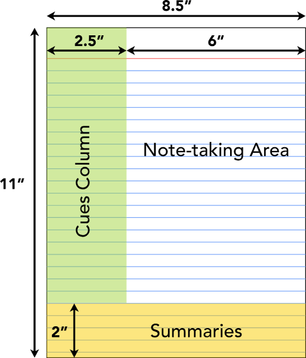

# Note Taking Tips

## Steps On How To Take Better Notes
- Repetition
  - ~~What is revision of notes?~~
  - DO THE PROBLEMS MULTIPLE TIMES!!!!!

- Make clear tutorial problem solutions [word problems]
    - 1. capture = get all the info the teacher talked about on the problem. Add any extra verbal tips the teacher says
    - 2. comprehend = try to solve the problem again without looking at the solution
    - 3. consolidate = do the tutorial problems again, but this time, write out a detailed explanation on how to solve it.
      - do this by writing down the formulas before you use them.
      - define all the variables beforehand
      - put tables and charts if needed that are required to solve it.
      - add definitions or concepts right next to the part of the problem it relates to

- Plan your time
  - Course assessment list for each week
  - get the deliverables/tests for each week on this new list of weeks
  - 
  - identify the 'tougher' weeks and plan ahead for those weeks

- Organize notes
  - working that out

- If it doesnt make sense and instead of beating your head against it, LOOK IT UP ONLINE!!!
  - GO SEE PROFESSOR
  - ASK FOR HELP FROM PEERS

- Teach someone
  - you find out what you are strong in
  - you find out what you are weak in

---

Here is a concrete example of how a single problem from **ENGR 2120 (Dynamics)** or **ENGR 3050 (Circuits)** fills out each zone, followed by a GIF-style ASCII animation showing the step-by-step layout flow.

---

# Step-by-Step Layout Flow (Visual Breakdown)

---

## Detailed Content Breakdown by Zone

### **Right two/thirds (Filled *During* Class)**
- when to till: Live during the lecture
- What goes here: bulk raw content
  - main derivations., formulas, definitions, and theorems
  - diagrams, free-body diagrams, or circuit schematics
  - verbal emphasis from the instructor (e.g., "This boundary condition is where people lose points on exams").
  - use shorthand, arrows (->), and bullet points rather than full sentences.

### **Left third (Filled *After* Class)**
- when to fill: within 24 hours of class
- what goes here: keywords, test equations, and index tags that point directly across to the raw notes
  - *prompts:* "How to identify underdamping?", "damped oscillator standard form", "boundary condition check"
  - *high-level tags*: definition, derivation, exam trap
### **bottom fifth: summary (Filled *After* Class)**
- when to fill: at the very end of your review session
- what goes here: 2-3 sentences answering: "what was the core takeaway of this page/lecture in plain language?"
  - Example: "Derived the 2nd-order ODE for damped harmonic motion. Distinct roots in the characteristic equation determine whether the system is underdamped, critically damped, or over damped." 

# How to map the 3-panel method to Markdown for GitHub
## [Date] Lecture Topic: Damped Oscillations

### Summary (Panel 3)
Derived the 2nd-order ODE for mechanical damping. Root signs in the characteristic 
equation determine underdamped, overdamped, or critically damped response.

---

### Index & Cues (Panel 2)
- **C1:** General 2nd-order equation of motion
- **C2:** Damping factor vs. Natural frequency ($\gamma$ vs $\omega_0$)
- **C3:** [Exam Note] Handling boundary conditions

---

### Lecture Notes (Panel 1)

#### General Equation
$$m\ddot{x} + c\dot{x} + kx = 0$$

Dividing through by $m$:
$$\ddot{x} + 2\gamma\dot{x} + \omega_0^2 x = 0$$

- $\gamma = \frac{c}{2m}$
- $\omega_0 = \sqrt{\frac{k}{m}}$

#### Case Breakdown
1. $\gamma^2 > \omega_0^2$: **Overdamped** (no oscillations, exponential decay)
2. $\gamma^2 = \omega_0^2$: **Critically Damped** (fastest return to equilibrium)
3. $\gamma^2 < \omega_0^2$: **Underdamped** (oscillatory decay envelope)

> **Prof Note:** Always solve for constants $A$ and $B$ *after* applying the initial condition to position, not velocity first.