*This is a log of notes taken, issues encountered, and the solutions to those issues.*

# **Week: June 8-12 2026**

# Date: 6/12/26 

## Situation

### Where:
>/home/esmoss/virgo/examples/hello_cube/ 

### File: 
>hello_cube.py

### Action:
>[esmoss@pws0008 hello_cube]$ ./hello_cube.py 

I was trying to run the program hello_cube.py

### Error produced:
>Traceback (most recent call last):
>  File "./hello_cube.py", line 7, in <module>
>    from Virgo import VirgoScene
>  File "/home/esmoss/virgo/Virgo.py", line 7, in <module>
>    from VirgoInteractorStyles import (
>  File "/home/esmoss/virgo/VirgoInteractorStyles.py", line 9, in <module>
>    import numpy as np
>ModuleNotFoundError: No module named 'numpy'

### Solution:
In the virgo README.md line 68-81, specifically line 73: *python3 -m venv .venv && source .venv/bin/activate* once the .venv is created, you no longer need to use python3 -m venv .venv to create the virtual environment again.
Now each time you want to run the program you need to make sure that you are in that virtual environment by running source .venv/bin/activate.
we circumvented that by making an alias that when i now type "virgo" in the command line, the .bashrc?? 
File is looked at and sees that the command virgo means that i want to run the virtual environment source code. 
Spoke with Dan Jordan about how to launch the program hello_cube.py for virgo. When i attempted to run the file, I kept getting an error saying that numpy and other library. 
Just looked up the differences in python of a package, library, and extension. 
- Package: The actual directory structure on the hard drive.
- Library: The high-level umbrella term for a collection of tools.
- Extension: Code written in another language (like C) to boost Python's speed.

Ok, after that digress, Dan said that the issue was that i needed to be in the .venv. 
This is a virtual environment. 
So since i was getting this error (in my limited knowledge), my directory did not have the libraries for the virgo script hello_cube.py as an addressable source for my local environment to run the program. 

END 

---
# **Week: June 15-19 2026**

# Date: 6/16/26

## Situation

### Where: 
>/home/esmoss/virgo/notes/

### File: 
>vtk_assemblyPractice.py

### Action: 
Work on a waving arm to practice for making a solarPanel simulation

### Error produced:

### Solution: 
Copied the basic structure from vtk_assembly_arm_and_finger.py. 
Changed the cones to cylinders, and was able to make all the arm parts able to rotate. 
Then focused on rotating the joints in different axies. 
Chaning the hand parts to cubes (more like rectangles, you can choose the lengths of x, y, z). 
Found the vtkFiltersSource.pyi and was able to learn about the different classes. 
So, there are many things that occurred. 
One of the main issues was that the wrist was not setting on the end of the lower arm. 
I think, if i remember correctly, the class 'make_cube' was centering the cube 2, or so, units above where the wrist meets the end of the lower_arm. 
Now, I am trying to figure out how to control the rotation path of the parts of the arm. 
Right now, the parts of the arm, seem to do a few rotations. 
ALTHOUGH!! 
The fingers rotate a bit and then rotate back. 
This wont work for the satellite, but could at least get an arm to wave. 
Still gunna need an angle controller that can set the angle the item rotates to. 
I think it would be good to initiate the rotate variable and then have an event(from time or position) triggers the animation.

### Notes on issue and solution: 

---

# Date: 06/17/26

## Situation:
Just trying to get blender installed on my work computer.

### Notes on day:
To install Blender, I had to submit a couple NAMS requests. 
To install the software, I needed elevated privileges. 
To get these privileges, the requests: 
- Active Directory Workstation Administrator
- Workstation Admin (WA) 
needed to be approved. 
Note on the WA request, for the dates, it says to request the minimum length of time for the duration of the access. 
It does not state what the minimum was. 
I thought that meant around one day or so. 
It means a year.
Been working the solar panel now. 
I now have a working version of the arm waving, so i'm going to make into the solar panel being able to fold and unfold.

---

# **Week: June 22-26 2026**

# Date: 06/23/26 

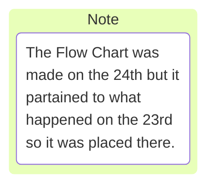

## Notes on day:
Nothing crazy going on today, just learing Markdown and YAML. 
I also want to work on the cylinder scale problem.

## Situation
The work item i have tasked to me right now is *support more specificity of cylinder prefab*.
We (Akshita, Dan and I) discussed this issue at length yesterday.
Dan wants there to be a virgo object tool or quick function where a user can easily call some prefab object in the corrisponding YAML file and get what they want out of it.
The issue is coming about where all of the different objects (cube, sphere, cone, cylinder, etc) have different dimentions and this will cause problems for virgo when it comes to compile. 
There already are *Set_Scale* functions in place elsewhere in vtk and virgo.
Errors fly when we tried to make the function *set_scale* in *VirgoActor.py*.
>set_scale(self, scale, format='uniform')

When we attempted to alter format, there were many issues (that I don't remember what they were) that arose. 
From my understanding the *format* of an *Actor* in vtk and virgo cannot be altered because so many things rely on format.
We then moved to the *scale* call for the function. 
Dan was trying to make *scale* into a list that the function could check to see if there were 1, 2 or 3 floats in that list. 
- If one, the *scale* call would just act as a scalar. 
There would not be a second and third float.
- Two, this would then utilize radius and height as the first and second floats respectivly.
There would not be a third float.
- Three, the floats would assume x,y,z scalars for the object.

**So, moving forward**
I think the play should be looking into how python works. 
The user will interact with a *YAML* file and this is where the scene is "built", meaning that the user dictates how the sim looks, plays and more.
I did a lot of searching through the files and followed through scene.yml and tried to find **how** Virgo reads the scene file.

Today was a day to learn how Virgo interacts with other files and software.

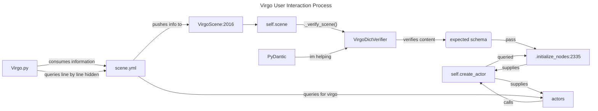

### Where:
NA 
### File: 
NA
### Action: 
NA
### Error produced:
NA
### Solution: 
NA
### Notes on issue and solution: 
NA

---

# Date: 06/24/26 

## Notes on day:
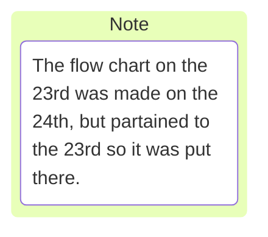
## Goals

Today's goals are to learn the pdb and hopefully figure out how to alter (effectvely) the YAML files that Virgo consumes for the examples. 
Once that if figured out, I should be able to make changes to the reader of the YAML file to accept the x,y,z,r of the dimentions for an object.

### Wizard Dan's knowledge nugget

So dan talked about having a function that could be called where asking for the scale would have the option of accepting the x,y,z,r dimentions of an object. 
This function would, based on the number of and which dimentions were entered, know what object the user wants to create and also use those dimensions on that object that it creates.

My questions, currently,
- where would this function be best utilized in the program
- how does the user know that *scale* is asking for, potentially, four different dimention
- can *scale* be used for the objects that the user brings in if they need to alter the literal scale of the object. (they might have gotting the scale off my a bit)
- ...

I think I like this but there is still the *where* that troubles me.


          #import pdb; pdb.set_trace()

## Situation

### Where:

### File: 

### Action: 

### Error produced:

### Solution: 

### Notes on issue and solution: 


# Date: 06/25/26 

## Notes on day:


Figured out how to get back into the remote server. 
Its real easy. On the left vertical bar, that has the file, search, git, etc., symbols. 
There is one that is called Remote Explorer. 
Click that and pick which folder you want to be in. 
Also, went to look for vending machines, got lost, twice, then found the stairs.
Reporting one snapple vending machine located on the second floor. 

## Goals
I think I should take the pdb tutorial like dan said yesterday. I still need to get more familiar with git, especially the fetch, push, pull business.

### PDB Notes
'The 5 pdb commands that will leave you "speechless"'
* l(ist)   - Displays 11 lines around the current line or continue the previous listing.
Can also state range you want to see. (ex: list 1, 13)
* s(tep)   - Execute the current line, stop at the first possible occasion.
* n(ext)   - Continue execution until the next line in the current function is reached or it returns.
* b(reak)  - Set a breakpoint (depending on the argument provided).
* r(eturn) - Continue execution until the current function returns.

~~sixth?~~

* h(elp)   - Without argument, print the list of available commands. 
With a command as an argument, print help about that command.

len(runner.dice)
  shows how many iterations an attribute will go through?

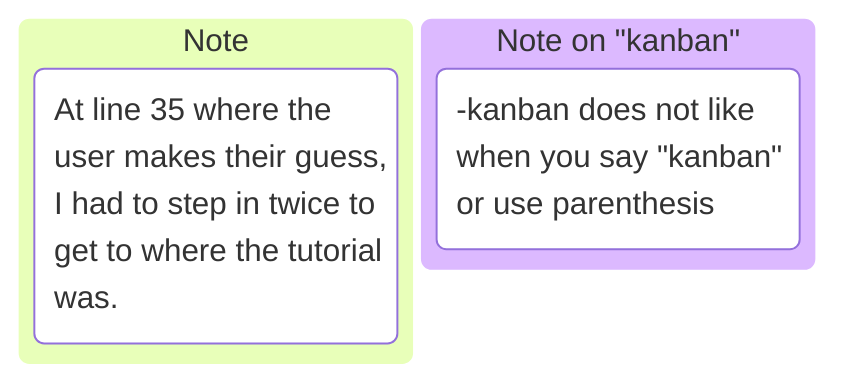
### dir()
dir(die)
  shows all the attributes for the instance. 
  Should look into this more. 
  Its not available for explanation in help.

### commands


### pdb Post Mortem
pdb.post_mortem(traceback=None)
    Enter post-mortem debugging of the given traceback object. If no traceback is given, it uses the one of the exception that is currently being handled
    (an exception must be being handled if the default is to be used).

pdb.pm()
    Enter post-mortem debugging of the traceback found in sys.last_traceback. 


## Meeting Notes
GNC_PAR
there is a merge request, and something about two steps to get info into Ramtaries. If their are multiple requests that point to different things, that makes a merge request conflict and that is no good.

## Situation

### Where:

### File: 

### Action: 

### Error produced:

### Solution: 

### Notes on issue and solution: 

---

# Date: 06/26/26 

## Notes on day:

So i'm still working on the pdb tutorial. I have managed to make the game playable, well it used to be, but now im chasing a bug where the game (GameRunner.run) only prints the first roll, and does not roll again.


## Situation
The pdb dicegame tutorial is kinda kicking my butt. I have made it playable but the dice still won't roll and print. I need to make another call in GameRunner.run(), to have the dice roll again, then it will print that new die value.

Gemini, also caught another bug. 

runner.py:46  print("The answer is: {}".format(runner.answer()))

@property 
def answer(self)

since 'answer' is now a property (attribute) of (because of @property) runner(the instance), runner.answer does not need () to be called on because answer now acts like an integer variable. 
if runner.answer() is used, "TypeError: 'int'object is not callable because its looking for a variable, not an object.

@classmethod

normally, methods inside a class are instance methods.
They take *self* as their first argument, meaning they only u work on a specific, already-created object (like one specific game runner).

The @classmethod decorator changes the method so it belongs to the class itself, not the instance of the class.
@classmethod (run) is attached to GameRunner (the class).
run is now a method (a function that *does* something), meaning you still need parentheses.

**Normal Methods:** Python automatically hands the method the specific, living object (the instance) so it can see its own stats. we call this *self*.
**Class Methods:** Python automatically hands the method the blueprint (the Class). We call this cls.

To help with clarification:
- The class = the blueprint
- The instance = the actual house

cls() is not run in disguise, its GunRunner in disguise. 


### Virgo Meeting with Akshita and Dan

They are't talking about merge requests for the VirgoActor
VirgoActor.py:78

Camera issue: the camera can lock up if it goes too close to the focal point.
  the camera should be blocked at a certain distance from the focal point.  
  either bounce back, or stop from moving forward because the distance is too close already.

Dan suggested that I work off of Akshita's branch and this way I can start and work off her.
She can help point me in the right direction when I veer off.

I finally pulled the proper branch.
had some difficulties with cleaning up my garbage branch before I pulled Akshita's branch.
Where I initially messed up is, I 'git clean'-ed my home directory like a dummy. So most of the essential git related files were deleted. 
Luckily, git saves your state all the time so getting it back wasn't bad.
So when I cleaned the home directory, my .bashrc file was erased, and this meant my terminal did not know where I was. 
The file .bashrc is a configure file in the home directory,
It tells the terminal what alias's I like to use, what the computers name is username, etc.
To get it back, I could copied the system's skeleton template,
1. cp /etc/skel/.bashrc ~/
2. source ~/.bashrc

But, the file was totally gone, so we made a brand new one.
1. echo "export PS1="\u@\h:"w$ "' > ~/.bashrc
2. source ~/.bashrc  # to activate it

I swapped directories to the Virgo directory, and everything was pretty easy to pull from Akshita's branch.
Well first I cleaned my branch up to do the fetch.

1. I made a .gitignore file with vim
2. then added them into .gitignore via
   1. echo "deps/trickpy/_ _ pycache _ _/" >> .gitignore
   2. echo "_ _ pycache _ _/" >> .gitignore


Then to pull from Akshita's branch
1. git fetch # to pull all the status from the main branch. updating my branches info
2. git switch 32-support-rectangular-prism-prefab


### Where:

"/home/esmoss/Log/Tutorials/pdb-tutorial/pdb-tutorial/dicegame/runner.py", line 7, in __init__
    self.dice = Die.create_dice()

### File: 

/home/esmoss/Log/Tutorials/pdb-tutorial/pdb-tutorial/dicegame/runner.py

### Action: 

Need to make the run function call for the die to be rolled again.

### Error produced:

(.venv) [esmoss@pws0008 pdb-tutorial]$ python main.py 
Add the values of the dice
It's really that easy
What are you doing with your life.
Traceback (most recent call last):
  File "/home/esmoss/Log/Tutorials/pdb-tutorial/pdb-tutorial/main.py", line 13, in <module>
    main()
  File "/home/esmoss/Log/Tutorials/pdb-tutorial/pdb-tutorial/main.py", line 9, in main
    GameRunner.run()
  File "/home/esmoss/Log/Tutorials/pdb-tutorial/pdb-tutorial/dicegame/runner.py", line 25, in run
    runner = cls()
             ^^^^^
  File "/home/esmoss/Log/Tutorials/pdb-tutorial/pdb-tutorial/dicegame/runner.py", line 7, in __init__
    self.dice = Die.create_dice()
                ^^^^^^^^^^^^^^^
AttributeError: type object 'Die' has no attribute 'create_dice' 

### Solution: In the works
EDIT (on 07/01/2026): I abandoned this problem to work on the work items for Virgo.

### Notes on issue and solution: 
Did not solve


### Git Path
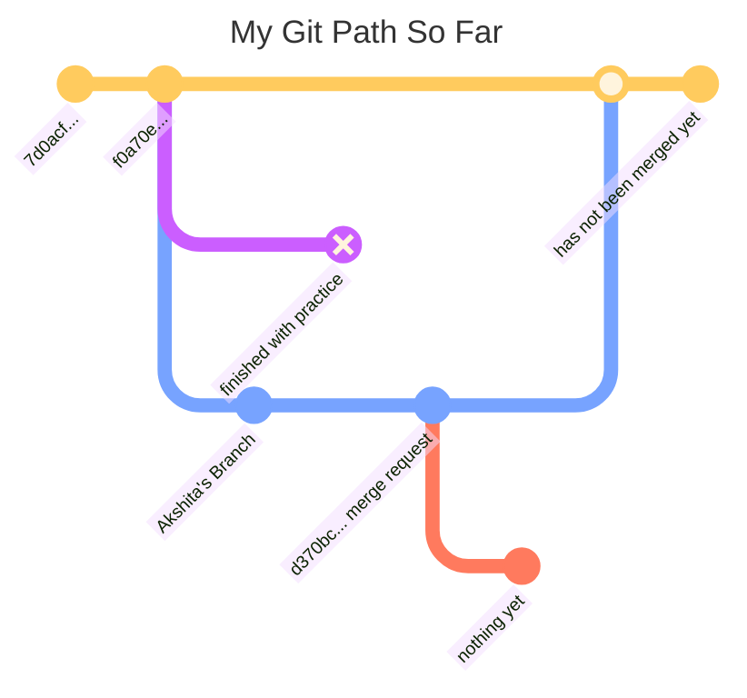

# **Week June 29 2026 - July 3 2026**
---

# Date: 06/29/26 


## Goals for the Day
Today I think I am going to start messing with the Virgo code to see what I can do. I'd like to make improvements to the cube/cylinder class/method. 

Check the work item log for some simple things to complete.

## Notes on day:

45.48 seconds with 45 degrees

Akshita pushed some commits and I *merged* with her branch to stay up to date.
I did this by **git fetch origin**, then **git merge origin/32-support-rectangular-prism**.
I had to clean up a bit so I ran **git stash** and **git clean -f**.

ok, i think i might have found where self.scene gets placed into the virgo program.
This would help pinpoint where to alter the VIRGO_PREFAB so that *scale* can be altered.

* (Pdb) where
* /home/esmoss/virgo/examples/cannon/cannon.py(239)<module>()
* ->sys.exit(CannonExample().run())
* /home/esmoss/virgo/examples/cannon/cannon.py(235)run()
* -> self.v.initialize()
* /home/esmoss/virgo/VirgoDataPlayback.py(44)initialize()
* -> super().initialize()
* /home/esmoss/virgo/Virgo.py(2113)initialize()
* ----> self.initialize_nodes()   # Load all actors from the self.scene info
* /home/esmoss/virgo/Virgo.py(2391)initialize_nodes()
* -> actors[a] = self.create_actor(actor_name=a, actor_scene_dict=self.scene['actors'][a])
* /home/esmoss/virgo/Virgo.py(2189)create_actor()
* -> actor = VirgoActor(
* /home/esmoss/virgo/VirgoActor.py(87)__init__()
* -> self._map_mesh(self.mesh)
* /home/esmoss/virgo/VirgoActor.py(368)_map_mesh()
* -> self.source.SetXLength(dims[0])
* (Pdb) 

So I found a spot where it looks like scale is being applied in the code.
> *Possible location*
> /home/esmoss/virgo/VirgoActor.py(99)__init__()
> self.axes_default_scale = 0.5 # Default scaling of axes to be applied 
> ~~*another possible location*~~
> > /home/esmoss/virgo/Virgo.py(2203)create_actor()
> -> actor.GetProperty().SetOpacity(opacity) # no, this is setting the opacity
> ~~*again*~~
> > /home/esmoss/virgo/Virgo.py(2211)create_actor() # this one creates the actor
> -> return actor
> 
 
 Virgot.py:2182
 Akshita found it for me

Need to focus on writing tests


## Situation
Cleaning up a messy git repo

### Where:
~/Virgo/

### File: 
Virgo repo

### Action: 
Learn and record how to work more efficiently with git

### Error produced:
(.venv) esmoss@pws0008:~/virgo$ git status
On branch 32-support-rectangular-prism-prefab
Your branch is up to date with 'origin/32-support-rectangular-prism-prefab'.

Changes not staged for commit:
  (use "git add <file>..." to update what will be committed)
  (use "git restore <file>..." to discard changes in working directory)
        modified:   VirgoActor.py

no changes added to commit (use "git add" and/or "git commit -a")
(.venv) esmoss@pws0008:~/virgo$ 

### Solution:
| git restore . | **or** | git restore <whole damn path -> Virgo |


### Notes on issue and solution: 
I almost remembered how to do this. I just forgot about the . and putting the name of the file after restore.


---

# Date: 06/30/26 

## Goals for the Day
Create a unit test for the cylinder dimensions in Virgo

## Notes on day:
In thinlinc, I had difficulties getting back into the virtual environment.
I fixed it by going to the virgo directory and putting in this command **python3.11 -m venv .venv && source .venv/bin/activate**.
This put me back into **(.venv) esmoss@pws0008:~/virgo$**.


To run a unit test, you write **python -m unittest <filename>**.
The flag -m stands for "module".
When you use -m, you are telling python: "look in your library of installed modules, find the one called *unittest*, and run it as if it were a standalone script."

In an attempt to run some unit tests on the ut_VirgoActor.py I found some things out.
The self.vis calls are actually showing the dimentions of the object or mesh.

I cleaned my repo, fetched, and merged with Akshita's repo again, and it all works.
Now i am trying to understand what is going on in the tests.
Gemini says that the error  

>AssertionError: Tuples differ: (0.5, 0.5, 0.5) != (0.2, 0.5, 0.5)
>
>First differing element 0:
>0.5
>0.2

(because i intentianally broke the test to see what happens) seen means that, 'the error message isnt showing you the rule it was looking for; it is showing you the reality of what went wrong.'

the **self.assertEqual(A, B))** is saying 'I demand that the codes output be equal to what I put in here. If not, then raise an error." 
There is also a **self.assertNotEqual(A, B)** says 'If A and B are not equal great, if equal throw the error'.

Also, look into the module **unittest**.

ok. Big news. I made a commit. 
>(.venv) esmoss@pws0008:~/virgo$ git log
>commit c8704d339cdd6280da3ee0ea49615304489edd8f (HEAD -> 32-support-rectangular-prism-prefab)
>Author: Moss <esmoss@pws0008..jsc.nasa.gov>
>Date:   Tue Jun 30 11:46:15 2026 -0500
>
>    In ut_VirgoActor.py:133,134 Ethan added assert lines for scale and dimensions.

I was also assigned another task by Dan. 
**The task is to add functions enable_trails() and disable_trails() to Virgo.py**.

The toggle_trails() function works well for inverting trail status for all nodes, but there is no function to just disable or enable the trails for all nodes. In a conversation with @nelson.m.guerreiro today we learned his Ramtares extensions would benefit from these new functions.
Assigning to @ethan.s.moss as I think this is a good standalone issue for him to tackle.  To close out the issue we need

c8704d339cdd6280da3ee0ea49615304489edd8f

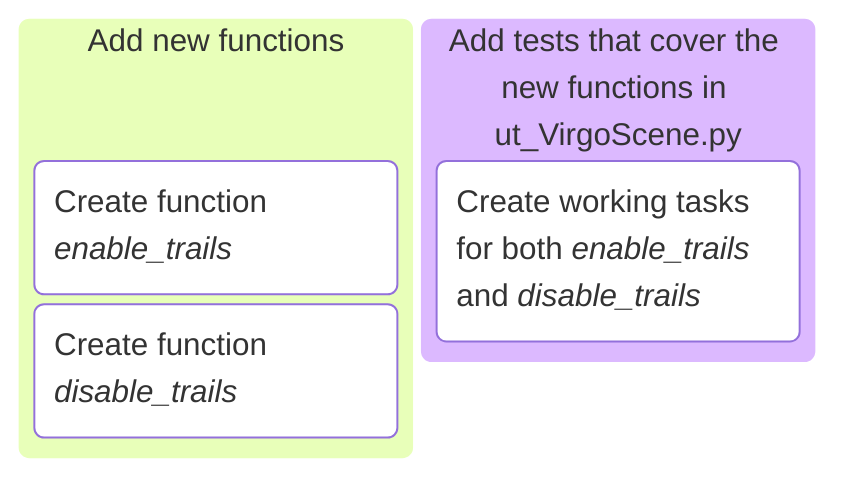
---
**under construction**
### put into the kanban above, or some other diagram
Convert to child item
     
Disable list item
Delete 

No child items are currently assigned. Use child items to break down work into smaller parts.
**under construction**

### Git Path
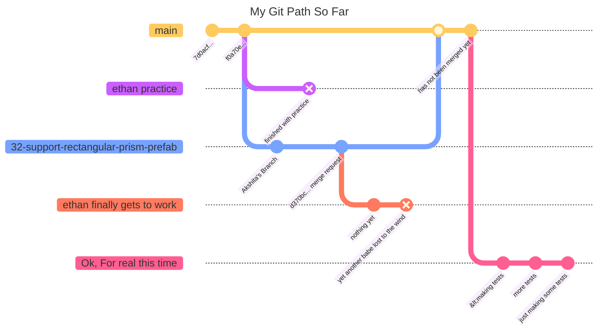

---
## Situation:
Making unit test for cylinder

### Where:
~/virgo/tests/

### File: 
ut_VirgoActor.py:129-143

### Action: 
ran test several times to ensure success.

### Error produced:
sometimes,

```
{
(.venv) esmoss@pws0008:~/virgo/tests$ python -m unittest ut_VirgoActor.
>VirgoActorTestCase.test_init_with_cylinder 
>Visualizing ut_VirgoActor.VirgoActorTestCase.test_init_with_cylinder. Exit window (q) to continue.
> /home/esmoss/virgo/tests/ut_VirgoActor.py(143)test_init_with_cylinder()
> -> assert_allclose(bb, [-1.0, 1.0, -2.5, 2.5, -0.998027, 0.998027])
> (Pdb) print(bb)
> (-1.0, 1.0, -2.5, 2.5, -0.9980267286300659, 0.9980267286300659)
> (Pdb) quit
> E
======================================================================
>ERROR: test_init_with_cylinder (ut_VirgoActor.VirgoActorTestCase.test_init_with_cylinder)
>Test the VIRGO_PREFAB:cylinder option with custom scaling
----------------------------------------------------------------------
>Traceback (most recent call last):
  File "/home/esmoss/virgo/tests/ut_VirgoActor.py", line 143, in test_init_with_cylinder
    assert_allclose(bb, [-1.0, 1.0, -2.5, 2.5, -0.9980267286300659, 0.9980267286300659])
    ^^^^^^^^^^^^^^^
  File "/usr/lib64/python3.11/bdb.py", line 90, in trace_dispatch
    return self.dispatch_line(frame)
           ^^^^^^^^^^^^^^^^^^^^^^^^^
  File "/usr/lib64/python3.11/bdb.py", line 115, in dispatch_line
    if self.quitting: raise BdbQuit
                      ^^^^^^^^^^^^^
bdb.BdbQuit

----------------------------------------------------------------------
>Ran 1 test in 79.934s
>
>FAILED (errors=1)
}
```

### Solution: 
Dan instructed me on how to evaluate the test as you go, and stated that throwing a wrench in the program was a good way to see how it works. 
So each iteration of changing the test to pin point a specific part of the codebase, give you more clues on what is either wrong or correct with your test. 
Being able to put *pdb.set_trace()* in the code to see what is going on under the hood, is surgical debugging. 
It is a fantastic tool.

Talking about the *pdb* tool, you can print an variables to see what their actual values are.
There was a point where we copied and pasted the "actual" array the code wanted, but it is so precise that we needed to print what bb actually was to find the entire value. 
ex.  
[4]: -0.9980267286300659 (ACTUAL), -0.998027 (DESIRED)
[5]: 0.9980267286300659 (ACTUAL), 0.998027 (DESIRED)
here (DESIRED) is basically saying, "in the test you stated that you wanted this value, but the actual is that super precise number".

I also made another one and i'll put it below for my future reference:

```
{
def test_init_with_scale_bb_cylinder(self):
  """
  Test the VIRGO_PREFAB:cylinder option with custom scaling and bounds
  """
  self.instance = VirgoActor(mesh="VIRGO_PREFAB:cylinder", dimensions=[5, 1], scale=0.5)
  #self.vis(actors=self.instance, show_origin=1, show_grid=1)

  self.instance.initialize()
  self.assertEqual(self.instance._user_scale, 0.5)
  self.assertEqual(self.instance.GetScale(), (0.5, 0.5, 0.5))
  bb = self.instance.GetBounds()
  self.vis(actors=self.instance, show_origin=1, show_grid=1)
  # Seeing if the bounds reflect the new scaling
  #import pdb; pdb.set_trace()
  # Z radius has no vertex at x=0. when x=0, z is at midpoint between vertcies. 
  #thus the z(+-) being != 0.5
  assert_allclose(bb, [-0.5, 0.5, -1.25, 1.25, -0.49901336431503296, 0.49901336431503296])
}
```

In between i was making commits the whole time. to save my progress so i dont lose anything

### Notes on issue and solution: 

## Final thoughts on day
Ensure that the Gantt Chart at the bottom of the doc is updated daily.
Needs to be finalized first though with work items and hopeful deadlines.


---

# Date: 07/01/26 

## Goals for the Day
I want to work on work item *Daniel-Jordan/virgo#39*. The project details are to 

**Add functinos enable_trails and disable_trails to Virgo.py**
* The toggle_trails function works well for inverting trail status for all nodes, but there is no function to just diable or enable the trails for all nodes. In a conversation with @nelson.m.guerreiro today, 06/30/26, we learned his Ramtares extensions would benefit from these new functions. Assigning to @ethan.s.moss as I think this is a good standalone issue for him to tackle
* To close out the issue we need
  1. add new functions
  2. add tests that conver the new functions in ut_VirgoScene.py

Been reading into this Virgo.py. 
In the [future ethan here, thats in **VirgoNode.py**] ~~class VirgoSceneNode(), on lines 721 - 738, there are some functions for the trail.~~
The trail is made available by the nodes. 
~~Line 772 is the function *create_trail(self, color=(1.0, 1.0, 1.0), thickness=2, opacity=1.0):*.~~

There is also a file named **VirgoTrail.py** with a class called *VirgoTrail*. 
probably important.

[x] Success

## Notes on day:
Ok. This is the code that I added to **Virgo.py**
```
{
def enable_trails(self):
  """Turn ON actor trails and start calculating math"""
  /# 1. Flip the master math flag (so the simulation knows to record)
  self.record_trails = True 
  /# 2. Turn on the visuals for all nodes
  for n in self.nodes:
      if not self.nodes[n].is_trail_visible():
        self.nodes[n].show_trail()
  print("Trails ENABLED")

def disable_trails(self):
  """Turn OFF actor trails and stop calculating math"""
  /# 1. Flip the master math flag (so the simulation stops recording)
  self.record_trails = False
  /# 2. Turn off the visuals for all nodes
  for n in self.nodes:
    if self.nodes[n].is_trail_visible():
      self.nodes[n].hide_trail()
  print("Trails DISABLED")
}
```
**^^^ this did not Work ^^^**


Working on the tests now.
What I came up with.

```
{
def test_enable_trails(self):
  """
  Test the Virgo.py VirgoControlCenter function enable_trails(self)
  """
  self.instance = VirgoScene(scene=self)
  self.assertTrue(self.instance.enable_trails, True)

def test_disable_trails(self):
  """
  Test the Virgo.py VirgoControlCenter function enable_trails(self)
  """
  self.instance = VirgoScene(scene=self)
  self.assertFalse(self.instance.disable_trails, False)
}
```
**^^^ This aint it either ^^^**

!!!TO RUN THE TESTS!!!
  **python -m unittest <filename>**

We'll see if it works.
well not the first try. 

```
{
======================================================================
ERROR: test_disable_trails (ut_VirgoScene.VirgoSceneInitTestCase.test_disable_trails)
Test the Virgo.py VirgoControlCenter function enable_trails(self)
----------------------------------------------------------------------
Traceback (most recent call last):
  File "/home/esmoss/virgo/tests/ut_VirgoScene.py", line 88, in test_disable_trails
    self.instance = VirgoScene(scene=self)
                    ^^^^^^^^^^^^^^^^^^^^^^
  File "/home/esmoss/virgo/Virgo.py", line 2058, in __init__
    self._verify_scene()
  File "/home/esmoss/virgo/Virgo.py", line 2183, in _verify_scene
    vdv = VirgoDictVerifier(scene_dict=self.scene, yaml_file=self.scene_yaml_path)
          ^^^^^^^^^^^^^^^^^^^^^^^^^^^^^^^^^^^^^^^^^^^^^^^^^^^^^^^^^^^^^^^^^^^^^^^^
  File "/home/esmoss/virgo/VirgoDictVerifier.py", line 642, in __init__
    self.scene_dict = scene_dict.copy()
                      ^^^^^^^^^^^^^^^
AttributeError: 'VirgoSceneInitTestCase' object has no attribute 'copy'

======================================================================
ERROR: test_enable_trails (ut_VirgoScene.VirgoSceneInitTestCase.test_enable_trails)
Test the Virgo.py VirgoControlCenter function enable_trails(self)
----------------------------------------------------------------------
Traceback (most recent call last):
  File "/home/esmoss/virgo/tests/ut_VirgoScene.py", line 81, in test_enable_trails
    self.instance = VirgoScene(scene=self)
                    ^^^^^^^^^^^^^^^^^^^^^^
  File "/home/esmoss/virgo/Virgo.py", line 2058, in __init__
    self._verify_scene()
  File "/home/esmoss/virgo/Virgo.py", line 2183, in _verify_scene
    vdv = VirgoDictVerifier(scene_dict=self.scene, yaml_file=self.scene_yaml_path)
          ^^^^^^^^^^^^^^^^^^^^^^^^^^^^^^^^^^^^^^^^^^^^^^^^^^^^^^^^^^^^^^^^^^^^^^^^
  File "/home/esmoss/virgo/VirgoDictVerifier.py", line 642, in __init__
    self.scene_dict = scene_dict.copy()
                      ^^^^^^^^^^^^^^^
AttributeError: 'VirgoSceneInitTestCase' object has no attribute 'copy'

----------------------------------------------------------------------
Ran 3 tests in 1.525s

FAILED (errors=2)
}
```

### The working functions
```
IN Virgo.VirgoScene:2547 - 2568 
{
   # Enable Trails Function
    @virgo_console  
    def enable_trails(self):
        """Turn ON actor trails and start calculating math"""
        # 1. Flip the master math flag (so the simulation knows to record)
        self.record_trails = True 
        # 2. Turn on the visuals for all nodes
        for n in self.nodes:
            if not self.nodes[n].is_trail_visible():
                self.nodes[n].show_trail()
        print("Trails ENABLED")

    # Disable Trails Function
    @virgo_console
    def disable_trails(self):
        """Turn OFF actor trails and stop calculating math"""
        # 1. Flip the master math flag (so the simulation stops recording)
        self.record_trails = False
        # 2. Turn off the visuals for all nodes
        for n in self.nodes:
            if self.nodes[n].is_trail_visible():
                self.nodes[n].hide_trail()
        print("Trails DISABLED")
}
```
### The working tests
```
IN ut_VirgoScene.VirgoSceneInitTestCase:77 - 91
{
 def test_enable_trails(self):
        """
        Test the Virgo.py VirgoControlCenter function enable_trails(self)
        """
        self.instance = VirgoScene(scene=self.scene, headless=True)
        self.instance.enable_trails()
        self.assertTrue(self.instance.record_trails)

    def test_disable_trails(self):
        """
        Test the Virgo.py VirgoControlCenter function enable_trails(self)
        """
        self.instance = VirgoScene(scene=self.scene, headless=True)
        self.instance.disable_trails()
        self.assertFalse(self.instance.record_trails)
}
```
## Work Item thoughts

So, there were a lot of things that were good learning events for me. 

I asked Gemini what the self, self.bla things are.
It said that a *Method* is just a function that lives inside the class (like enable_trails(self)).
It said that an *Attribute* is a variable that belongs to the object (like self.record_trails).

```
{
  class Robot:
  def __init__(self):
    # 'self.name' is an attribute of the ROBOT, not of the __init__ method.
    self.name = "R2-D2"
    self.battery_level = 100

  def say_hello(self):
    # because 'name' belongs to 'self' (the robot), this method can access it
    print(f"Beep boop! I am {self.name}.")
}
```


## Situation

### Where:

### File: 

### Action: 

### Error produced:

### Solution: 

### Notes on issue and solution: 

## Final thoughts on day

Ensure that the Gantt Chart at the bottom of the doc is updated daily.
Needs to be finalized first though with work items and hopeful deadlines.

---

# Date: 07/07/26 

## Goals for the Day
[/]get push(s) to go through.  
[x]make some tests for the cube and the cylinder  
[ ]look into the new work item, *make our own axes*

## Notes on day:
Oh my days. I thought my push from the first was fine, but there were some things i forgot to clean up.
I was also working on the mood object to be added to the mesh folder.
Did not finish because needed to correct my branch push.
Now I need to make some tests for the cube and cylinder pre-fabs.
After that I have a new Work Item, 
>**Consider rolling our own axes as vtkAxesActor bounding box does not behave** 

>"Described in detail here: https://discourse.vtk.org/t/vtkaxesactor-bounding-box-appears-to-be-affected-by-its-world-position/16290/2, I'm not convinced we're going to get a resolution to this from the VTK folks and our workaround which is to "use a sparingly as it turns off camera clipping computations" is not going to hold up long term.
>We may choose to abandon the vtkAxesActor and build our own frame for nodes using more primitive 3D arrows and/or lines. This may be our only choice as visualizing where frames are is a must and we can't seem to get an answer to the bounding box issue described in the VTK discourse link above."

*making this addition on the 7th* \
My git branch was hecked up, so Dan came and saved the day.
I had two different work items (issues) on the same branch.
I **think** this is what happened (trying to remember).
This is the terminal history  of what happened.

```
{
  643  git checkout -b 39-add-enable-disable-trails origin/master
  644  git branch
  645  git checkout 32-support-rectangular-prism-prefab -- tests/ut_VirgoScene.py Virgo.py
  646  git status
  647  git diff --cached
  648  git commit
  649  git push
  650  git push origin 39-add-enable-disable-trails
  651  git branch
  652  git checkout 39-add-enable-disable-trails
  653  git checkout origin/master -- tests/ut_VirgoScene.py Virgo.py 
  654  git status
  655  git diff cache
  656  git diff --cache
  657  git diff --cached
  658  git commit
  659  git branch
  660  git reset --hard HEAD
  661  git checkout 32-support-rectangular-prism-prefab
  662  git branch
  663  git status
  664  git commit
  665  git push origin 32-support-rectangular-prism-prefab
  666  git branch
  667  git diff --cached
  668  git diff
  669  git diff --help
  670  git diff origin/master 32-support-rectangular-prism
  671  git log
  672  git diff 32-support-rectangular-prism-prefab origin/32-support-rectangular-prism-prefab
  673  git diff origin/32-support-rectangular-prism-prefab  32-support-rectangular-prism-prefab
  674  git diff origin/32-support-rectangular-prism-prefab  HEAD/32-support-rectangular-prism-prefab
  675  git diff origin/master HEAD
}
```

This was when Akshita pushed to 32-support-rectangular-prism-prefab.
I got confused and thought I messed something up.
This is the terminal history of what happened. #LostToy

```
{
  643  git checkout -b 39-add-enable-disable-trails origin/master
  644  git branch
  645  git checkout 32-support-rectangular-prism-prefab -- tests/ut_VirgoScene.py Virgo.py
  646  git status
  647  git diff --cached
  648  git commit
  649  git push
  650  git push origin 39-add-enable-disable-trails
  651  git branch
  652  git checkout 39-add-enable-disable-trails
  653  git checkout origin/master -- tests/ut_VirgoScene.py Virgo.py 
  654  git status
  655  git diff cache
  656  git diff --cache
  657  git diff --cached
  658  git commit
  659  git branch
  660  git reset --hard HEAD
  661  git checkout 32-support-rectangular-prism-prefab
  662  git branch
  663  git status
  664  git commit
  665  git push origin 32-support-rectangular-prism-prefab
  666  git branch
  667  git diff --cached
  668  git diff
  669  git diff --help
  670  git diff origin/master 32-support-rectangular-prism
  671  git log
  672  git diff 32-support-rectangular-prism-prefab origin/32-support-rectangular-prism-prefab
  673  git diff origin/32-support-rectangular-prism-prefab  32-support-rectangular-prism-prefab
  674  git diff origin/32-support-rectangular-prism-prefab  HEAD/32-support-rectangular-prism-prefab
  675  git diff origin/master HEAD
}
```

## Situation

### Where:

### File: 

### Action: 

### Error produced:

### Solution: 

### Notes on issue and solution: 

---

# Date: 07/08/26 

## Goals for the Day
[x]get push(s) to go through.  
This push is for the *enable_trails()* and *disable_trails()* functions. 
Which is the 39-add-enable-disable-trails branch.
Also for branch 32-support-rectangular-prism-prefab.
~~currently having issues with getting it to work WITHOUT *self.record_trails*~~
[x]make some tests for the ~~cube and the~~ cylinder.
~~I think this is might be unnecessary.~~ 
~~Although, it would be good practice anyway.~~ 
[ ]look into the new work item, *make our own axes*
[-]Add the Mars obj to Virgo

## Notes on day:
Dan gave some feedback on the 32-support-rectangular-prism-prefab merge request.
My to-do's:
ut_VirgoActor.py
  [x] Spelling mistake in line 169
  [x] Add test_init_with_dimensions_and_scale_cylinder
  - this will make the cylinder larger by scaling it

## Situation

### Where:

### File: 

### Action: 

### Error produced:

### Solution: 

### Notes on issue and solution: 

---

# Date: 07/09/26 

## Goals for the Day
[] Start on the custom axes issue<br>
&ensp;[] Create the assembly<br>
&ensp;[] Find out where to put it in the code<br>
[] Make a function for the custom axes<br>
&ensp;[] Make tests for said function<br>
[] Fix the enable and disable trails functions<br>
&ensp; - Dan wants enable trails to function in a similar way to toggle_trails() calls self.nodes[n].show() for all nodes. The inverse should happen for disable trails<br>
&ensp; [] fix enable_trails()<br>
&ensp; [] fix disable_trails()<br>

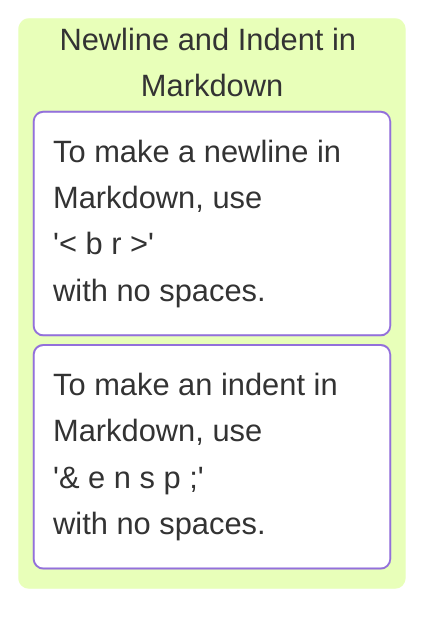
## Notes on day:
So, yesterday was a big day. The cylinder scale issue was resolved and merged into master.<br>
>Here is the VIRGO_PREFAB:cylinder code
```
VirgoActor.py:376
elif 'VIRGO_PREFAB:cylinder' in str(mesh):
            self.source = vtkCylinderSource()
            self.source.SetHeight(1.0)         # Set height to 3 units
            self.source.SetRadius(0.5)         # Set radius to 1 unit
            self.source.SetCenter(0.0, 0.0, 0.0) # 
            self.source.SetResolution(50)      # Use 50 facets for a smooth cylinder
            self.source.SetCapping(True)       # Ensure the bases are capped
            # Create a mapper to map the cube's geometry to graphics primitives
            mapper.SetInputConnection(self.source.GetOutputPort())
```
>My contribution
```
ut_VirgoActor.py:170
    def test_init_with_dimensions_cylinder(self):
        """
        Test the VIRGO_PREFAB:cylinder option with custom dimensions - regular case
        """
        self.instance = VirgoActor(mesh="VIRGO_PREFAB:cylinder", dimensions=[5, 1])
        #self.vis(actors=self.instance, show_origin=1, show_grid=1)
        self.instance.initialize()
        self.assertEqual(self.instance.GetScale(), (1.0, 1.0, 1.0))
        #self.vis(actors=self.instance, show_origin=1, show_grid=1)
        bb = self.instance.GetBounds()
        # Z radius is at midpoint of line between vertices
        assert_allclose(bb, [-1.0, 1.0, -2.5, 2.5, -0.9980267286300659, 0.9980267286300659])

    def test_init_with_dimensions_and_scale_cylinder(self):
        """
        Test the VIRGO_PREFAB:cylinder option with custom dimensions - regular case
        """
        self.instance = VirgoActor(mesh="VIRGO_PREFAB:cylinder", dimensions=[5.0, 1.0], scale=2.0)
        #self.vis(actors=self.instance, show_origin=1, show_grid=1)
        self.instance.initialize()
        self.assertEqual(self.instance.GetScale(), (2.0, 2.0, 2.0))
        #self.vis(actors=self.instance, show_origin=1, show_grid=1)
        bb = self.instance.GetBounds()
        # Z radius is at midpoint of line between vertices
        assert_allclose(bb, [-2.0, 2.0, -5.0, 5.0, -1.99605345726, 1.99605345726])

    def test_init_with_zero_dimensions_cylinder(self):
        """
        Test the VIRGO_PREFAB:cylinder option with custom dimensions - zero error case
        """
        with self.assertRaises(ValueError):
            self.instance = VirgoActor(mesh="VIRGO_PREFAB:cylinder", dimensions=[0,0])
            #self.vis(actors=self.instance, show_origin=1, show_grid=1)
```
These tests made sure the function can be called and values can be placed in for the dimensions and the scale. 
Both independently and simultaneously.


## Situation

### Where:

### File: 

### Action: 

### Error produced:

### Solution: 

### Notes on issue and/or solution: 

**INFORMAL TECH TALK MEETING NOTES**
Camera clipping range, and this is relivenet to the axes work item.
Auto-Fitting with ResetCameraClippingRange()
**This is a problem because of the graphics card**
- the graphics card can only do single point ??accuracy??
- the vtkAxesActor was created to be used by the vtkOrientationMarkerWidget

*question for dan*,<br>
are these axes all pointed in the respective x, y and z axes for the universe?<br>
or is it on the centered object like the earth or moon?

Should the clipping 'origin' be focused on the camera, because the clipping is based on that camera?<br>
depth test is only 1e7 big/long.<br>
background/mid-ground/foreground<br>

pyproject.toml. What is a .toml file?<br>

uv? like pip?<br>

typically you would put all the virgo files in a directory called virgo. 
not sure why.<br>

```
blonde dude (Jermstad, Jonathan) threw out some sort of example.
dependencies = [
    ...
    "pisces @ git+ssh://git@gitlab-.jsc.nasa.gov/aamt-tools/pisces.git@main",
]
```


---

# Date: 07/10/26 

## Goals for the Day
 
- Dan wants enable trails to function in a similar way to toggle_trails() calls self.nodes[n].show() for all nodes. The inverse should happen for disable trails<br>
[x] Fix the enable and disable trails functions<br>
&ensp; [x] fix enable_trails()<br>
&ensp; [x] fix disable_trails()<br>


## Notes on day:
what an effective day. beat my head against the problem for a while before asking Gemini for help.

Was finally able to get the functions right and also the tests associated with them.

**Virgo.py**
```
    # Enable Trails Function
    @virgo_console
    def enable_trails(self, node=None):
        """Turn on actor trails globally, or for a specific node."""
        # Create a list to keep track of what we turned on
        active_trails = []
        # If a specific node was passed in, just turn on that one
        if node is not None:
            node.show_trail()
            active_trails.append(node.name)
        # If the parentheses were empty, loop through all nodes
        else:
            for n in self.nodes:
                self.nodes[n].show_trail()
                active_trails.append(n) # n is already the name string
        # Actually hand the list back to the user/test!
        return active_trails

    # Disable Trails Function
    @virgo_console
    def disable_trails(self, node=None):
        """Turn off actor trails globally, or for a specific node."""
        # Create a list to keep track of what we turned off
        disabled_trails = []
        # If a specific node was passed in, just turn off that one
        if node is not None:
            node.hide_trail() 
            disabled_trails.append(node.name)
        # If the parentheses were empty, loop through all nodes
        else:
            for n in self.nodes:
                self.nodes[n].hide_trail()
                disabled_trails.append(n) # n is already the name string
        # Hand the list back so your tests can verify it!
        return disabled_trails
```
**ut_VirgoScene.py**
```
    def test_add_node(self):
        # 1. Setup the scene and initialize it
        self.instance = VirgoScene(scene=self.scene, headless=True)
        self.instance.initialize()
        testingScene = VirgoScene(scene=self.scene)
        # 2. Create a node 
        addedNode, _ = self.instance.create_node(actor=None, actor_scene_dict={})
        addedNode.name = "New_Node"
        # 3. Count the number of nodes before passing node into scene
        initial_count = len(testingScene.nodes)
        # 4. Pass node into scene
        testingScene.add_node(addedNode)
        # 5. Test if the count of the scenes nodes increased
        assert len(testingScene.nodes) == initial_count + 1
        # 6. Assert that the node created is actually in the scene
        # and make sure its value and name match
        assert addedNode in testingScene.nodes.values()
        assert addedNode.name in testingScene.nodes
        print(f"{addedNode.name} was passed through the scene")

    def test_trails_on(self):
        # 1. Setup
        self.instance = VirgoScene(scene=self.scene, headless=True)
        self.instance.initialize()
        # 2. Create TWO nodes to prove the master switch actually loops!
        node_1, _ = self.instance.create_node(actor=None, actor_scene_dict={})
        node_1.name = "Alpha_Node"
        node_2, _ = self.instance.create_node(actor=None, actor_scene_dict={})
        node_2.name = "Beta_Node"
        self.instance.add_node(node_1)
        self.instance.add_node(node_2)
        # 3. The Action: Call the master switch exactly ONCE
        enabled_list = self.instance.enable_trails()
        # 4. The Verification: Check that BOTH nodes made it into the list
        assert node_1.name in enabled_list
        assert node_2.name in enabled_list
        print("enabled trails test passed!")

    def test_trails_off(self):
        # 1. Setup
        self.instance = VirgoScene(scene=self.scene, headless=True)
        self.instance.initialize()
        # 2. Let's create TWO nodes to prove the master switch actually loops!
        node_1, _ = self.instance.create_node(actor=None, actor_scene_dict={})
        node_1.name = "Alpha_Node" # Ensure they have unique names
        node_2, _ = self.instance.create_node(actor=None, actor_scene_dict={})
        node_2.name = "Beta_Node"
        self.instance.add_node(node_1)
        self.instance.add_node(node_2)
        # 3. Turn everything ON
        self.instance.enable_trails()
        # 4. The Action: Call the master switch exactly ONCE
        disabled_list = self.instance.disable_trails()
        # 5. The Verification: Check that BOTH nodes made it into the list
        assert node_1.name in disabled_list
        assert node_2.name in disabled_list
        print("disabled trails test passed!")
```

## Situation
Initial problem is just to make *enable_trails()* and *disable_trails()*
The difficulty came in on finding where and how nodes were actually created in Virgo.
I made an initial test for the initial gross enable_trails(). 
It made its own node and passed it through the scene created and checked if it came out the same as it went in.
Dan came by to check on me. 
He spoke some truth and wisdom nuggets as he usually does. 
It was a bit over my head at the time, but I wrote down what I understood from the convo.

From what I understood, he wanted the test I had made where the node is created, passes it through the scene for the test, and checks if its the same on the other side. 
He liked it but wanted it to utilize the Virgo native functions and files.
So the earch for how Virgo created its nodes was on.


I found, using grep (specifically "grep  -rn --exculde-dir=".venv" "def add_node"), the function that creates the nodes. I found it in VirgoDataPlayback.py on line 46.
Afterwards I found it, the same damn thing, in Virgo.py line 2223. Not sure why it is redundant on there, and will tell Dan about that.

Anyways, now Gemini could actually help me make the actual functions.

Gemini says 
```
# 1. You must create the node first (and it MUST have a name)
my_new_node = Node(name="Database_Node") # The exact arguments might vary

# 2. Add it to the ControlCenter/Scene
my_scene.add_node(my_new_node)

# 3. (Optional) Add another node and make it a child of the first one
child_node = Node(name="Query_Node")
my_scene.add_node(child_node, parent_name="Database_Node")
```

The way that nodes are created goes
```
my_new_node, parent_name = self.instance.create_node(actor=None, actor_scene_dict={})
```
### Where:


### File: 
ut_VirgoScene.py
Virgo.py

### Action: 

### Error(s) produced:

### Solution: 
The code below is the solutions for the enable and disable trails functions and their respective tests are below.

### Notes on issue and solution: 
    def create_node(self, actor, actor_scene_dict=None, _class=VirgoSceneNode):
        """
        Creates a VirgoSceneNode associated with actor from the information
        in actor_scene_dict. This function also maps the data in the
        driven_by: section of the actor_scene_dict to a data_source in
        the created node. The result is a VirgoSceneNode ready to be
        included in the larger VirgoDataPlayback framework via
        self.add_node()

        Args:
          _class (cls): Class to instantiate, must be or derive from VirgoActor

        Returns: Tuple of (VirgoSceneNode, parent_name [str])
        """
        node, parent_name = super().create_node(actor=actor, actor_scene_dict=actor_scene_dict, _class=_class)

        # Figure out the details of how the actor/node is driven and produce a
        # VirgoDataSource with the data from the driven_by: specification and
        # assign that data source to node vis node.set_data_source.
        positions = None
        rotations = None
        scales = None
        opacities = None
        times = None
        driven_by = None
        additional_data={}
        if 'driven_by' in actor_scene_dict and actor_scene_dict['driven_by'] != None:
            driven_by= dict(actor_scene_dict['driven_by']) # make a copy
            if 'time' in driven_by and  driven_by['time'] != None:
                times = self.vdl.get_alias_datas(alias=driven_by['time'])
            if 'pos' in driven_by and  driven_by['pos'] != None:
                positions= self.vdl.get_alias_datas(alias=driven_by['pos'])
            if 'rot' in driven_by and  driven_by['rot'] != None:
                rotations = self.vdl.get_alias_datas(alias=driven_by['rot'])
            if 'scale' in driven_by and  driven_by['scale'] != None:
                scales = self.vdl.get_alias_data(alias=driven_by['scale'])
            if 'opacity' in driven_by and  driven_by['opacity'] != None:
                opacities = self.vdl.get_alias_data(alias=driven_by['opacity'])
            if 'transpose_rot' in driven_by and  driven_by['transpose_rot'] != None:
                node.set_transpose_dcm(driven_by['transpose_rot'])

        if ('provide_data' in actor_scene_dict and 
            actor_scene_dict['provide_data'] != None):
            provide_data= dict(actor_scene_dict['provide_data']) # make a copy
            add_data= list(provide_data['aliases'])              # make a copy
            # For every additional_data requested, get the full time-history
            # of that data from the data loader
            for alias in add_data:
                additional_data[alias] = self.vdl.get_alias_data(alias=alias)
            # In the case where driven_by isn't given, times must be populated
            # for the VirgoDataFileSource construction, so get it from the
            # provide_data: time: value. TODO: It would be nice if this was
            # more intuitive as the class needs times but there's 2 ways it
            # can be specified by the user here so this feels kinda clunky
            #  -Jordan 6/2026
            if times == None:
                times = self.vdl.get_alias_datas(alias=provide_data['time'])

        if ( positions or rotations or scales or opacities or times or
             additional_data):
            # Create the data source. Pass additional_data dict through as kwargs
            # which make those aliases available to the node
            vds = VirgoDataFileSource(times=times, rotations=rotations,
                                      positions=positions, scales=scales,
                                      opacities=opacities, **additional_data )
            vds.initialize()
            node.set_data_source(vds)
            #import pdb; pdb.set_trace()


        # If labels: are provided for the node/actor, 
        if 'labels' in actor_scene_dict:
            labels = actor_scene_dict['labels']
            for label in labels:
                if labels[label] == None:
                    continue
                # TODO: can we just node.get_label(label).get_text() here instead?
                if 'text' in labels[label]:
                  text = labels[label]['text']
                vds_for_labels = self.get_data_source_from_label_text(label_text=text)
                node.get_label(label).set_data_source(data_source=vds_for_labels)

        return node, parent_name
---
*steralized version**
    def create_node(self, actor, actor_scene_dict=None, _class=SceneNode):
        """
        Creates a SceneNode associated with actor from the information
        in actor_scene_dict. This function also maps the data in the
        driven_by: section of the actor_scene_dict to a data_source in
        the created node. The result is a SceneNode ready to be
        included in the larger DataPlayback framework via
        self.add_node()

        Args:
          _class (cls): Class to instantiate, must be or derive from Actor

        Returns: Tuple of (SceneNode, parent_name [str])
        """
        node, parent_name = super().create_node(actor=actor, actor_scene_dict=actor_scene_dict, _class=_class)

        # Figure out the details of how the actor/node is driven and produce a
        # DataSource with the data from the driven_by: specification and
        # assign that data source to node vis node.set_data_source.
        positions = None
        rotations = None
        scales = None
        opacities = None
        times = None
        driven_by = None
        additional_data={}
        if 'driven_by' in actor_scene_dict and actor_scene_dict['driven_by'] != None:
            driven_by= dict(actor_scene_dict['driven_by']) # make a copy
            if 'time' in driven_by and  driven_by['time'] != None:
                times = self.vdl.get_alias_datas(alias=driven_by['time'])
            if 'pos' in driven_by and  driven_by['pos'] != None:
                positions= self.vdl.get_alias_datas(alias=driven_by['pos'])
            if 'rot' in driven_by and  driven_by['rot'] != None:
                rotations = self.vdl.get_alias_datas(alias=driven_by['rot'])
            if 'scale' in driven_by and  driven_by['scale'] != None:
                scales = self.vdl.get_alias_data(alias=driven_by['scale'])
            if 'opacity' in driven_by and  driven_by['opacity'] != None:
                opacities = self.vdl.get_alias_data(alias=driven_by['opacity'])
            if 'transpose_rot' in driven_by and  driven_by['transpose_rot'] != None:
                node.set_transpose_dcm(driven_by['transpose_rot'])

        if ('provide_data' in actor_scene_dict and 
            actor_scene_dict['provide_data'] != None):
            provide_data= dict(actor_scene_dict['provide_data']) # make a copy
            add_data= list(provide_data['aliases'])              # make a copy
            # For every additional_data requested, get the full time-history
            # of that data from the data loader
            for alias in add_data:
                additional_data[alias] = self.vdl.get_alias_data(alias=alias)
            # In the case where driven_by isn't given, times must be populated
            # for the DataFileSource construction, so get it from the
            # provide_data: time: value. TODO: It would be nice if this was
            # more intuitive as the class needs times but there's 2 ways it
            # can be specified by the user here so this feels kinda clunky
            #  -Jordan 6/2026
            if times == None:
                times = self.vdl.get_alias_datas(alias=provide_data['time'])

        if ( positions or rotations or scales or opacities or times or
             additional_data):
            # Create the data source. Pass additional_data dict through as kwargs
            # which make those aliases available to the node
            vds = DataFileSource(times=times, rotations=rotations,
                                      positions=positions, scales=scales,
                                      opacities=opacities, **additional_data )
            vds.initialize()
            node.set_data_source(vds)
            #import pdb; pdb.set_trace()


        # If labels: are provided for the node/actor, 
        if 'labels' in actor_scene_dict:
            labels = actor_scene_dict['labels']
            for label in labels:
                if labels[label] == None:
                    continue
                # TODO: can we just node.get_label(label).get_text() here instead?
                if 'text' in labels[label]:
                  text = labels[label]['text']
                vds_for_labels = self.get_data_source_from_label_text(label_text=text)
                node.get_label(label).set_data_source(data_source=vds_for_labels)

        return node, parent_name
---

# Date: 07/13/26 

## Goals for the Day
[/] Begin working on the VirgoAxesActor
&ensp;[] Make the arrows
&ensp;[] Make those arrows into an assembly

## Notes on day:
Added some file ?types? to my ".gitignore"
".gitignore" can utilize * as a wildcard that will match whatever you put next to it and hunt down files that are attached to the *.
In my case I put *.swp. 
Git will search down and file ending in .swp and ignore it.
The other is __pycache__/.
Git will ignore all files inside of the __pycache__ folder now.


So I was able to make the virgoAxesActor, but Dan said it would be better to do it with just the arrow meshes.
This way it'll be easier to make it if it only uses arrows, not cones and cylinders.

### Dan Notes on enable/disable trails merge request
#### tests/ut_VirgoScene.py
**test_add_node**
- The test_add_node function created the VirgoScene multiple times unnecessarily.
- just need to use *self.instance* because that is the scene.
- There is no need to use another new *testingScene* that initiates another VirgoScene
- Also, it is not required to use *headless=true*
- Need to fix the asserts
  - while they are technically correct there are unittest [conventions](https://docs.python.org/3/library/unittest.html#unittest.TestCase.debug) to follow.
  - These should be changed to self.assert*()
- Apparently this created a weird error that Dan is going to follow up on with a separate work item.
  >  File "/Users/ddjorda1/dev/virgo/Virgo.py", line 743, in on_timer
  >    self.update()
  >  <br>File "/Users/ddjorda1/dev/virgo/Virgo.py", line 431, in update
  >    self.configure_renderers()
  >  <br>File "/Users/ddjorda1/dev/virgo/Virgo.py", line 551, in configure_renderers
  >    self.renderers[current_layer].RemoveActor(assembly)
- Nodes need to be added before *self.instance.initialize()* is called.
**test_trails_off**
- A lot of the same comments apply to this function as well, so recheck through all of those on this and following functions.
- make sure to delete irrelevant comments and code, like "master switch" which is never called on in the code.
#### Virgo.py
>Overall a much better approach here so kudos on that! 
>I probably should have guided you on this a bit sooner but I think these new functions need to live in the VirgoControlCenter class (in the same file), not in VirgoScene class. 
>Two reasons - the first is that @virgo_console is only valid for VirgoControlCenter (notice your new functions don't show up in help in the virgo console), and this is the class intended to "control the scene", so that's where functions that control the scene should go. 
>Accordingly we'll need to move these two tests for these new functions from ut_VirgoScene.py to ut_VirgoControlCenter.py. 
>I would recommend we remove the add_node() calls from these test_trails_*() tests as well and use the simpler method of just adding a new actor to self.scene() below line 30 here. 
>The add_node() approach should work but add_node() only exists in the VirgoScene class which doesn't exist in ut_VirgoControlCenter.py. 
>I'm going to try to take your branch and flesh out a skeleton for tests in that new file to make sure we don't run into any other architectural issues, so stand by on this MR until I push commits to your branch.
>Interesting enhancement idea for specifying an individual node to alter. 
>Your function docstring doesn't explain that option though, nor does it say what is expected to be returned, which appears to be a list of names of nodes that were modified by the function.  
>Furthermore, there's no check that node is of type SceneNode, which means someone could call this with node='mynodename' (a string, not a Node) and then line 2533 would error.
>Before we jump into adding all that documentation and new error checking code - this is great example of how we can do practically anything in software, but the question of "should we do this?" is the harder one to answer. 
>Meaning, "should we provide the node as an optional argument for turning a single node's trail on?". 
>For that I like to think about how it would be used by an end user. 
>Issue #39 is intended to help a user enable/disable all nodes at once (keep them from having to write the dictionary loop you are doing), so how hard is it right now for a user to disable a single node? 
>Would looks something like this in VirgoControlCenter:
```
# In a class that inherits from `VirgoControlCenter`, to disable a
# trail for a node with name 'mynodename':
self.get_node(name='mynodename').hide_trail()

```
>So a user can disable one named Node with one line of code. 
>Should we add all the documentation and error checking and list-of-modified-nodes logic to enable_trails() and disable_trails()? 
>To me it looks like this is already very easy for the user, so as a design choice I'd argue we don't need node=None or any of the logic for modifying a single node at the VirgoControlCenter class level. 
>With that logic removed, the function becomes extremely simple:
```
    @virgo_console
    def enable_trails(self):
        """Turn on all actor trails"""
        for n in self.nodes:
            self.nodes[n].show_trail()

```
>I do appreciate the forward thinking you've done here though and definitely a good idea if there wasn't already an easy way to enable/disable a single node's trail.

So that was a lot. 
Just a bunch of tips that I should think about while I code. 


## Situation

### Where:

### File: 

### Action: 

### Error produced:

### Solution: 

### Notes on issue and solution: 


---

# Date: 07/14/26 

## Goals for the Day
[/] Sort out the branch 39-add-enable-disable-trails
[/] Make progress on the new axesActor 

## Notes on day:
This is two days in the futre when im writing this. I dont really remember what i did. I know that the enable/disable functions were mentally assaulting me.
---

# Date: 07/15/26 

## Goals for the Day
[x] Sort out the branch 39-add-enable-disable-trails
[/] Make progress on the new axesActor 

## Notes on day:
Had a meeting with Dan and Akshita. 
They helped me understand the difference between classes, functions, and variables. 
Also, how they interact with eachother and what they can do.

Dan also said that the enable/disable functions were kindof messed up from the jump. 
When he realized that it needed to be altered in a bunch of other files, he took the reigns and let me work on the new axesActor.

I began working on the axes actor and I initially had made it with cones and cylinders. 
Dan said he'd rather me work with the arrow actors instead because it would be less pieces. 
I agreed and began to work on the axes.

### How virgo_axes_with_arrows.py works
There is an initial value that I intend to help scale the virgo axes.
It is called *coordinate_val* that will scale the axes.
This is temporarily be called *axes_scale*.
This was chosen because VirgoNode.py (where the vtkAxesActor lives and the new axes_actor will go) has many references to this already, so i thought it might be useful in the new axes.

In the parameters of the function, start_point, end_point, radius=1, colors=(1.0, 1.0, 1.0) are used.
The start_point and end_point are used to compute the actual length of the arrow. 
```
    # 1. Compute the distance and vector
    dx = end_point[0] - start_point[0]
    dy = end_point[1] - start_point[1]
    dz = end_point[2] - start_point[2]
    length = math.sqrt(dx**2 + dy**2 + dz**2)
```
It then creates *arrow_source = vtk.vtkArrowSource()*

The main problem I had was corrected here.
Hopefully it stays corrected for Dan while Virgo changes.
```
    # Define the perfect aspect ratio for a 1.0-unit arrow.
    # Because we scale uniformly later, these proportions will NEVER change.
    arrow_source.SetShaftRadius(0.03)  # 3% of the total length
    arrow_source.SetTipRadius(0.1)     # 10% of the total length
    arrow_source.SetTipLength(0.3)     # 30% of the total length is the arrowhead
```
Before I tried to have the radius scale with the *coordinate_val* but this caused issues for the renderer due to how the radius' are coded.
So the fix was to have the set radius attributes for vtkArrowSource as a ratio of the initial creation of vtkArrowSource.
This way when the arrow is scaled later, the Shaft and Tip radius' are already set by being dependent of the arrow_source, not a single value.
Later, the arrow will be transformed to accept the new scaling.

Resolution is set next to 32. 
This can be changed if it is not smooth enough.

The vtk.vtkPolyDataMapper is instantiated as mapper.
mapper then gets 


## Situation
There was an issue when I began to scale it, the radius could not keep up with the length. Eventually, the radius would wither to nearly nothing and you wouldnt be able to see the axes anymore when the scale was large enough. The opposite happened as you got smaller. It would get more squat and wide as if the radius, again could not keep up with the length. It would shrink faster than it's radius could.
 
### Where:

### File: 

### Action: 

### Error produced:

### Solution: 

### Notes on issue and solution: 
---
# Date: 07/16/26 

## Goals for the Day
[x] Make progress on the new axesActor (I definetly made progress)

## Notes on day:
I agreed and began to work on the axes.

### Notes on Informal Tech Talk Meeting with Dan
**cppcheck** will look over your code for errors.
I think this might be a static analysis.
**NPR-7150**

VirgoAxes.py is where the virgo_axes lives now and also has its own ut_virgoAxes.py as well. 
**Need to make a line option for the arrows to turn into**
**In Read me line 417 to 425**
**history !<number> and then the number on the history in your terminal will be auto run**

### How virgo_axes_with_arrows.py works
There is an initial value that I intend to help scale the virgo axes.
It is called *coordinate_val* that will scale the axes.
This is temporarily be called *axes_scale*.
This was chosen because VirgoNode.py (where the vtkAxesActor lives and the new axes_actor will go) has many references to this already, so i thought it might be useful in the new axes.

In the parameters of the function, start_point, end_point, radius=1, colors=(1.0, 1.0, 1.0) are used.
The start_point and end_point are used to compute the actual length of the arrow. 
```
    # 1. Compute the distance and vector
    dx = end_point[0] - start_point[0]
    dy = end_point[1] - start_point[1]
    dz = end_point[2] - start_point[2]
    length = math.sqrt(dx**2 + dy**2 + dz**2)
```
It then creates *arrow_source = vtk.vtkArrowSource()*

The main problem I had was corrected here.
Hopefully it stays corrected for Dan while Virgo changes.
```
    # Define the perfect aspect ratio for a 1.0-unit arrow.
    # Because we scale uniformly later, these proportions will NEVER change.
    arrow_source.SetShaftRadius(0.03)  # 3% of the total length
    arrow_source.SetTipRadius(0.1)     # 10% of the total length
    arrow_source.SetTipLength(0.3)     # 30% of the total length is the arrowhead
```
Before I tried to have the radius scale with the *coordinate_val* but this caused issues for the renderer due to how the radius' are coded.
So the fix was to have the set radius attributes for vtkArrowSource as a ratio of the initial creation of vtkArrowSource.
This way when the arrow is scaled later, the Shaft and Tip radius' are already set by being dependent of the arrow_source, not a single value.
Later, the arrow will be transformed to accept the new scaling.

Resolution is set next to 32. 
This can be changed if it is not smooth enough.

The vtk.vtkPolyDataMapper is instantiated as mapper.
mapper then gets 


## Situation
There was an issue when I began to scale it, the radius could not keep up with the length. Eventually, the radius would wither to nearly nothing and you wouldnt be able to see the axes anymore when the scale was large enough. The opposite happened as you got smaller. It would get more squat and wide as if the radius, again could not keep up with the length. It would shrink faster than it's radius could.
 
### Where:

### File: 

### Action: 

### Error produced:

### Solution: 

### Notes on issue and solution: 
<br>

<br>


---
# Date: 07/17/26 

## Goals for the Day
[] Finish the test for start and end point in ut_ VirgoAxes.py
[] Finish with defining the start and end point test in ut_VigroAxes.py
[] Make a line setting for the style of the axes.
[x] Make a length setting for an option to have one arrow be longer than the others, one shorter, or all three different lengths.
[x] Email Sara Peternell to ask about Pathways docs need to be filled out.

## Notes on day:
*** Requirements for the VirgoAxes.py**
```
README.md starting at line 417
    axes:   # The dictionary which holds information about this actor's axes
      when: # Optional string setting for when interal axes should be
            #   displayed with accepted values as follows:
            #   toggled - show axes when global setting (key:'a') is toggled
            #             This is the default option
            #   picked  - show axes when setting toggled and actor is picked
            #   always  - always show axes
            #   never   - never show axes
      style:  # Optional string setting for style of axes - line or cylinder
      length: # Optional list of 3 floats describing the length of each axis
              #  [x_axis, y_axis, z_axis]
      affect_opacity: # Optional bool (0 or 1) setting for whether opacity
                      #   of the actor should be reduced when axes are shown.
                      #   Defaults to 1 (true).
```

### TrajOpt: A modular Python Framework for EDL Trajectory and Algorithm Design

<br>
<br>
**keywords in presentation**<br>
Sequential convex programming and related approaches<br>
??EDL??<br>
Trust region<br>
solver cvxpy, 'PIQP'<br>
what are costs in regards to python or solvers<br>

Apparently trajopt is a python software.


README.md:
spelling correction.
VirgoAxes.py:
added xlen, ylen, and zlen to VirgoAxes. 
These allow the changing of the individual lengths of any arrow. 
They do not affect the radius of the tip or shaft of their respective arrows.
ut_VirgoAxes.py:
made test for scale, and made several tests for inputing the individual lengthening of each axes.
Also, made tests with changing two or three axes independently. 
Made test to check negative number

## Situation

### Where:

### File: 

### Action: 

### Error produced:

### Solution: 

### Notes on issue and solution: 

---
# Date: 07/20/26 

## Goals for the Day
[] Go to [Exit Forms for Pathways](https://nasa.sharepoint.com/teams/JSCPathwaysInternSite/Shared%20Documents/Forms/AllItems.aspx?id=%2Fteams%2FJSCPathwaysInternSite%2FShared%20Documents%2FSelf%20Service%2FSelf%2DService%2FExit%20Forms%20and%20Information&viewid=3b1c77fb%2D0100%2D475b%2Dba3b%2D7b1c351ab9e9&newTargetListUrl=%2Fteams%2FJSCPathwaysInternSite%2FShared%20Documents&viewpath=%2Fteams%2FJSCPathwaysInternSite%2FShared%20Documents%2FForms%2FAllItems%2Easpx) and finish your paperwork.
[] change VirgoAxes lenght adjustment to its own function. VirgoAxes:131


## Notes on day:

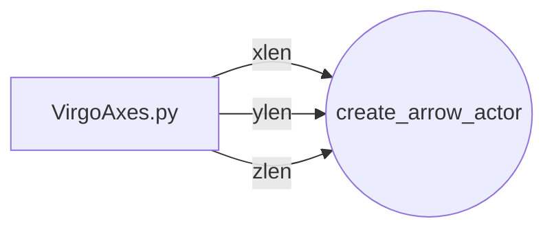

## Situation
 
### Where:

### File: 

### Action: 

### Error produced:

### Solution: 

### Notes on issue and solution: 

---
# Date: 07/23/26 

## Goals for the Day
[x] Meet with Brady Campbell
[x] Work on VirgoAxes (In fact, It might be done)
[] Work on log
[] Work on Exit Presentation

## Notes on day:
Form JF760 and IT Assets
  - Fill this out last
  - click box two
  - NOT box one
FEHB Form POD-07
  - Should only need amount paid per paycheck
  - Figure out who to send it to.
~~JSC NF1860: Approval for Outside Activity ??~~

---
The issue with the axes not shutting off.
Success is defined as the code does as dictated
Fail is defined as the code does NOT do as dictated

test1: Success.
Actors
- ball: when = never
Vectors
- f_drag: when = never
- f_gravity: when = never
- f_bounce: when = never
*reasoning*<br>
I think the parent AND the specific children you want off both need to be never for the axes to disappear.

test2: Success
Actors
- ball: when = never
Vectors
- f_drag: when = commented out
- f_gravity: when = never
- f_bounce: when = never
*reasoning*<br>
the drag axes was present

test3: success
Actors
- ball: when = never
Vectors
- f_drag: when = never
- f_gravity: when = commented out
- f_bounce: when = never
*reasoning*<br>
the gravity axes was present

test4: success
Actors
- ball: when = commented out
Vectors
- f_drag: when = never
- f_gravity: when = never
- f_bounce: when = never
*reasoning*<br>
the ball axes was present

test5: success
Actors
- ball: when = commented out
Vectors
- f_drag: when = never
- f_gravity: when = never
- f_bounce: when = always
*reasoning*<br>
the ball, and bounce axes were present

test6: success
Actors
- ball: when = always
Vectors
- f_drag: when = never
- f_gravity: when = never
- f_bounce: when = always
*reasoning*<br>
the ball, and bounce axes were present

test7: success
Actors
- ball: when = never
Vectors
- f_drag: when = always
- f_gravity: when = never
- f_bounce: when = never
*reasoning*<br>
the drag axes was present
---
### GIT DIFF
I made many changes to the code and i wasnt sure on when or where i made changes to it.
i'm going to check what I did by git diff.

### Whats up with VirgoAxes
So, i've been working on VirgoAxes for some time now (about a week), and I think it might be done. 
At least its close to it. 
I pushed it earlier today, maybe around 1400, and the pipeline failed.
I went and asked Akshita what to do.
She said that Dan wanted to handle those problems.
I asked Dan what he thought and he looked it up and showed me that the problem was that show_axes in VirgoNode was commented out.
I had forgot to uncomment it, and all that needed to be done was uncomment and put my functions from VirgoAxes where the other functions were called at.
I ran the tests again and everything passed. 
I added, commited, and pushed the branch.
It passed the pipeline. 
Second try.

### What was the initial problem with vtkAxesActor?


## Situation
 
### Where:

### File: 

### Action: 

### Error produced:

### Solution: 

### Notes on issue and solution: 

---

# Date: xx/xx/xx 

## Goals for the Day

## Notes on day:

## Situation
 
### Where:

### File: 

### Action: 

### Error produced:

### Solution: 

### Notes on issue and solution: 

---
# Date: xx/xx/xx 

## Goals for the Day

## Notes on day:

## Situation
 
### Where:

### File: 

### Action: 

### Error produced:

### Solution: 

### Notes on issue and solution: 

---

# Date: xx/xx/xx 

## Goals for the Day

## Notes on day:

## Situation
 
### Where:

### File: 

### Action: 

### Error produced:

### Solution: 

### Notes on issue and solution: 

---
# Date: xx/xx/xx 

## Goals for the Day

## Notes on day:

## Situation
 
### Where:

### File: 

### Action: 

### Error produced:

### Solution: 

### Notes on issue and solution: 

---

# Date: xx/xx/xx 

## Goals for the Day

## Notes on day:

## Situation
 
### Where:

### File: 

### Action: 

### Error produced:

### Solution: 

### Notes on issue and solution: 

---
# Date: xx/xx/xx 

## Goals for the Day

## Notes on day:

## Situation
 
### Where:

### File: 

### Action: 

### Error produced:

### Solution: 

### Notes on issue and solution: 

---

# Date: xx/xx/xx 

## Goals for the Day

## Notes on day:

## Situation
 
### Where:

### File: 

### Action: 

### Error produced:

### Solution: 

### Notes on issue and solution: 

---
# Date: xx/xx/xx 

## Goals for the Day

## Notes on day:

## Situation
 
### Where:

### File: 

### Action: 

### Error produced:

### Solution: 

### Notes on issue and solution: 

---

# Date: xx/xx/xx 

## Goals for the Day

## Notes on day:

## Situation
 
### Where:

### File: 

### Action: 

### Error produced:

### Solution: 

### Notes on issue and solution: 

---
# Date: xx/xx/xx 

## Goals for the Day

## Notes on day:

## Situation
 
### Where:

### File: 

### Action: 

### Error produced:

### Solution: 

### Notes on issue and solution: 

---


---
This is some code about the pdb (python debugger) and need to do a pdb tutorial
```
{
(.venv) [esmoss@pws0008launch]$ ./launch.py 
Simulation complete. Output written to log_lv.csv
[koviz] Listening on 127.0.0.1:64053
[koviz] KovizThread started, is_alive=True
Loading data from /home/esmoss/virgo/examples/launch...
Done.
> /home/esmoss/virgo/Virgo.py(2386)initialize_nodes()
-> actors[a] = self.create_actor(actor_name=a, actor_scene_dict=self.scene['actors'][a])
(Pdb) list
2381 	        trails = {}
2382 	
2383 	        if 'actors' in self.scene and self.scene['actors'] != None:
2384 	          for a in self.scene['actors']:
2385 	            import pdb; pdb.set_trace()
2386 ->	            actors[a] = self.create_actor(actor_name=a, actor_scene_dict=self.scene['actors'][a])
2387 	            actors[a].initialize()
2388 	
2389 	            node, parent_name = self.create_node(actor=actors[a],
2390 	                                                 actor_scene_dict=self.scene['actors'][a],
2391 	                                                 _class=ancc)
(Pdb) s
--Call--
> /home/esmoss/virgo/Virgo.py(2157)create_actor()
-> def create_actor(self, actor_name, actor_scene_dict=None,):
(Pdb) list
2152 	        """
2153 	        from VirgoDictVerifier import VirgoDictVerifier
2154 	        vdv = VirgoDictVerifier(scene_dict=self.scene, yaml_file=self.scene_yaml_path)
2155 	        self.scene = vdv.verify()
2156 	
2157 ->	    def create_actor(self, actor_name, actor_scene_dict=None,):
2158 	        """
2159 	        Given a single scene's actors: sub-entry, return a
2160 	        VirgoActor instance built from that information
2161 	
2162 	        TODO all this checking for dict/YAML validity needs to be safer, i.e.
(Pdb) pprint(actor_name)
*** NameError: name 'pprint' is not defined
(Pdb) print(actor_name)
earth
(Pdb) print(actor_scene_dict)
{'scale': 1.0, 'opacity': 1.0, 'pos': [0.0, 0.0, 0.0], 'ypr': [0.0, 0.0, 0.0], 'color': None, 'pickable': False, 'parent': 'ecef_frame', 'backface_culling': True, 'provide_data': None, 'axes': None, 'trail': None, 'driven_by': None, 'labels': {}, 'mesh': 'VIRGO_PREFAB:wgs84-earth'}
(Pdb) 
}
```

```
Documented commands (type help <topic>):
========================================
EOF    c          d        h         list      q        rv       undisplay
a      cl         debug    help      ll        quit     s        unt      
alias  clear      disable  ignore    longlist  r        source   until    
args   commands   display  interact  n         restart  step     up       
b      condition  down     j         next      return   tbreak   w        
break  cont       enable   jump      p         retval   u        whatis   
bt     continue   exit     l         pp        run      unalias  where    

Miscellaneous help topics:
==========================
```

Virgo.py:2157

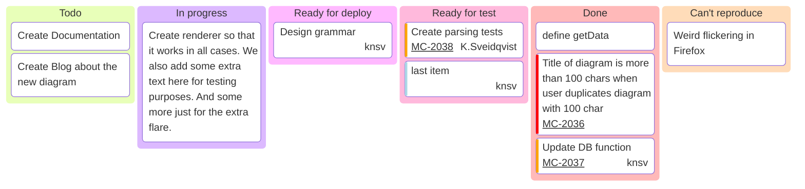

### **SANKEY EXAMPLE**
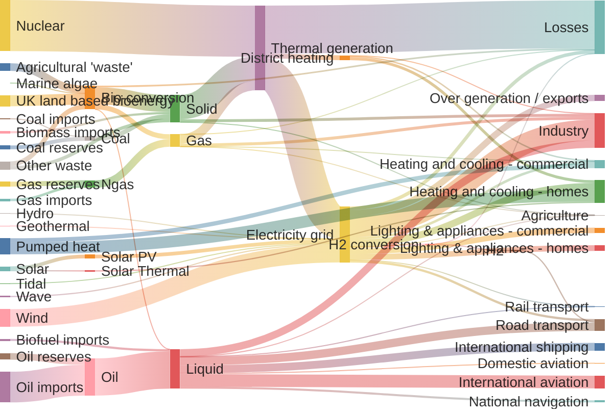
---
### **GANTT EXAMPLE**
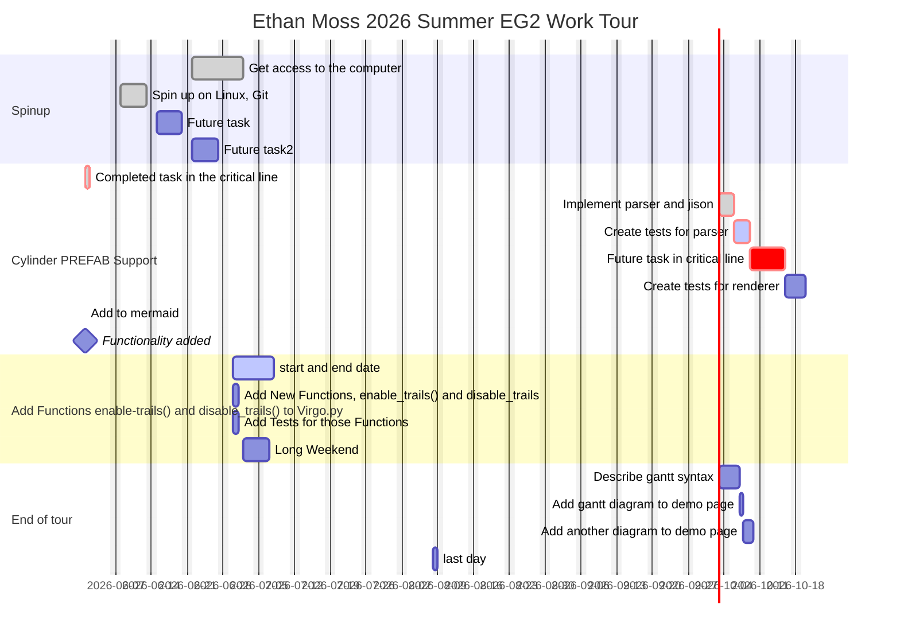

---
# Template for the log

# Date: xx/xx/xx 

## Goals for the Day

## Notes on day:

## Situation
 
### Where:

### File: 

### Action: 

### Error produced:

### Solution: 

### Notes on issue and solution: 

---
# Date: xx/xx/xx 

## Goals for the Day

## Notes on day:

## Situation
 
### Where:

### File: 

### Action: 

### Error produced:

### Solution: 

### Notes on issue and solution: 

---