*This is a log of notes taken, issues encountered, and the solutions to those issues.*

# **Week: June 8-12 2026**

# Date: 6/12/26 

## Situation

### Where:
>/home/esmoss/virgo/examples/hello_cube/ 

### File: 
>hello_cube.py

### Action:
>[esmoss@fslpws0008 hello_cube]$ ./hello_cube.py 

I was trying to run the program hello_cube.py

### Error produced:
>Traceback (most recent call last):
>  File "./hello_cube.py", line 7, in <module>
>    from Virgo import VirgoScene
>  File "/home/esmoss/virgo/Virgo.py", line 7, in <module>
>    from VirgoInteractorStyles import (
>  File "/home/esmoss/virgo/VirgoInteractorStyles.py", line 9, in <module>
>    import numpy as np
>ModuleNotFoundError: No module named 'numpy'

### Solution:
In the virgo README.md line 68-81, specifically line 73: *python3 -m venv .venv && source .venv/bin/activate* once the .venv is created, you no longer need to use python3 -m venv .venv to create the virtual environment again.
Now each time you want to run the program you need to make sure that you are in that virtual environment by running source .venv/bin/activate.
we circumvented that by making an alias that when i now type "virgo" in the command line, the .bashrc?? 
File is looked at and sees that the command virgo means that i want to run the virtual environment source code. 
Spoke with Dan Jordan about how to launch the program hello_cube.py for virgo. When i attempted to run the file, I kept getting an error saying that numpy and other library. 
Just looked up the differences in python of a package, library, and extension. 
- Package: The actual directory structure on the hard drive.
- Library: The high-level umbrella term for a collection of tools.
- Extension: Code written in another language (like C) to boost Python's speed.

Ok, after that digress, Dan said that the issue was that i needed to be in the .venv. 
This is a virtual environment. 
So since i was getting this error (in my limited knowledge), my directory did not have the libraries for the virgo script hello_cube.py as an addressable source for my local environment to run the program. 

END 

---
# **Week: June 15-19 2026**

# Date: 6/16/26

## Situation

### Where: 
>/home/esmoss/virgo/notes/

### File: 
>vtk_assemblyPractice.py

### Action: 
Work on a waving arm to practice for making a solarPanel simulation

### Error produced:

### Solution: 
Copied the basic structure from vtk_assembly_arm_and_finger.py. 
Changed the cones to cylinders, and was able to make all the arm parts able to rotate. 
Then focused on rotating the joints in different axies. 
Chaning the hand parts to cubes (more like rectangles, you can choose the lengths of x, y, z). 
Found the vtkFiltersSource.pyi and was able to learn about the different classes. 
So, there are many things that occurred. 
One of the main issues was that the wrist was not setting on the end of the lower arm. 
I think, if i remember correctly, the class 'make_cube' was centering the cube 2, or so, units above where the wrist meets the end of the lower_arm. 
Now, I am trying to figure out how to control the rotation path of the parts of the arm. 
Right now, the parts of the arm, seem to do a few rotations. 
ALTHOUGH!! 
The fingers rotate a bit and then rotate back. 
This wont work for the satellite, but could at least get an arm to wave. 
Still gunna need an angle controller that can set the angle the item rotates to. 
I think it would be good to initiate the rotate variable and then have an event(from time or position) triggers the animation.

### Notes on issue and solution: 

---

# Date: 06/17/26

## Situation:
Just trying to get blender installed on my work computer.

### Notes on day:
To install Blender, I had to submit a couple NAMS requests. 
To install the software, I needed elevated privileges. 
To get these privileges, the requests: 
- Active Directory Workstation Administrator
- Workstation Admin (WA) 
needed to be approved. 
Note on the WA request, for the dates, it says to request the minimum length of time for the duration of the access. 
It does not state what the minimum was. 
I thought that meant around one day or so. 
It means a year.
Been working the solar panel now. 
I now have a working version of the arm waving, so i'm going to make into the solar panel being able to fold and unfold.

---

# **Week: June 22-26 2026**

# Date: 06/23/26 

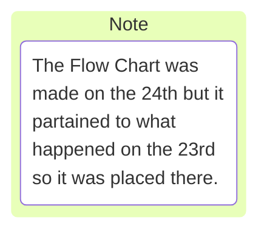

## Notes on day:
Nothing crazy going on today, just learing Markdown and YAML. 
I also want to work on the cylinder scale problem.

## Situation
The work item i have tasked to me right now is *support more specificity of cylinder prefab*.
We (Akshita, Dan and I) discussed this issue at length yesterday.
Dan wants there to be a virgo object tool or quick function where a user can easily call some prefab object in the corrisponding YAML file and get what they want out of it.
The issue is coming about where all of the different objects (cube, sphere, cone, cylinder, etc) have different dimentions and this will cause problems for virgo when it comes to compile. 
There already are *Set_Scale* functions in place elsewhere in vtk and virgo.
Errors fly when we tried to make the function *set_scale* in *VirgoActor.py*.
>set_scale(self, scale, format='uniform')

When we attempted to alter format, there were many issues (that I don't remember what they were) that arose. 
From my understanding the *format* of an *Actor* in vtk and virgo cannot be altered because so many things rely on format.
We then moved to the *scale* call for the function. 
Dan was trying to make *scale* into a list that the function could check to see if there were 1, 2 or 3 floats in that list. 
- If one, the *scale* call would just act as a scalar. 
There would not be a second and third float.
- Two, this would then utilize radius and height as the first and second floats respectivly.
There would not be a third float.
- Three, the floats would assume x,y,z scalars for the object.

**So, moving forward**
I think the play should be looking into how python works. 
The user will interact with a *YAML* file and this is where the scene is "built", meaning that the user dictates how the sim looks, plays and more.
I did a lot of searching through the files and followed through scene.yml and tried to find **how** Virgo reads the scene file.

Today was a day to learn how Virgo interacts with other files and software.

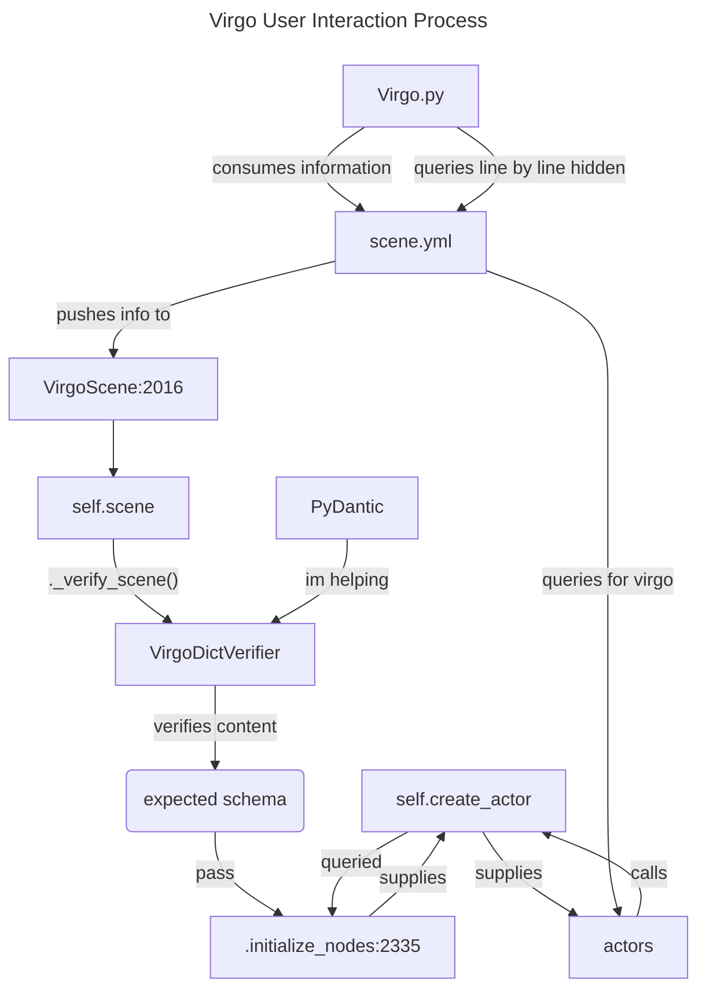

### Where:
NA 
### File: 
NA
### Action: 
NA
### Error produced:
NA
### Solution: 
NA
### Notes on issue and solution: 
NA

---

# Date: 06/24/26 

## Notes on day:
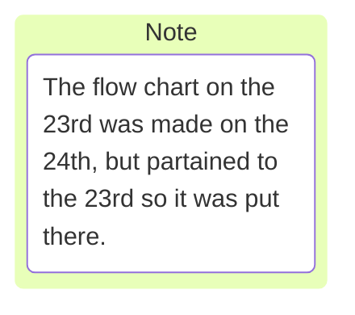
## Goals

Today's goals are to learn the pdb and hopefully figure out how to alter (effectvely) the YAML files that Virgo consumes for the examples. 
Once that if figured out, I should be able to make changes to the reader of the YAML file to accept the x,y,z,r of the dimentions for an object.

### Wizard Dan's knowledge nugget

So dan talked about having a function that could be called where asking for the scale would have the option of accepting the x,y,z,r dimentions of an object. 
This function would, based on the number of and which dimentions were entered, know what object the user wants to create and also use those dimensions on that object that it creates.

My questions, currently,
- where would this function be best utilized in the program
- how does the user know that *scale* is asking for, potentially, four different dimention
- can *scale* be used for the objects that the user brings in if they need to alter the literal scale of the object. (they might have gotting the scale off my a bit)
- ...

I think I like this but there is still the *where* that troubles me.


          #import pdb; pdb.set_trace()

## Situation

### Where:

### File: 

### Action: 

### Error produced:

### Solution: 

### Notes on issue and solution: 


# Date: 06/25/26 

## Notes on day:
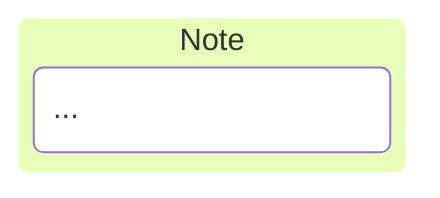

Figured out how to get back into the remote server. 
Its real easy. On the left vertical bar, that has the file, search, git, etc., symbols. 
There is one that is called Remote Explorer. 
Click that and pick which folder you want to be in. 
Also, went to look for vending machines, got lost, twice, then found the stairs.
Reporting one snapple vending machine located on the second floor. 

## Goals
I think I should take the pdb tutorial like dan said yesterday. I still need to get more familiar with git, especially the fetch, push, pull business.

### PDB Notes
'The 5 pdb commands that will leave you "speechless"'
* l(ist)   - Displays 11 lines around the current line or continue the previous listing.
Can also state range you want to see. (ex: list 1, 13)
* s(tep)   - Execute the current line, stop at the first possible occasion.
* n(ext)   - Continue execution until the next line in the current function is reached or it returns.
* b(reak)  - Set a breakpoint (depending on the argument provided).
* r(eturn) - Continue execution until the current function returns.

~~sixth?~~

* h(elp)   - Without argument, print the list of available commands. 
With a command as an argument, print help about that command.

len(runner.dice)
  shows how many iterations an attribute will go through?

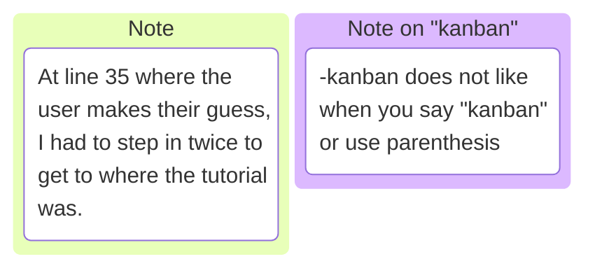
### dir()
dir(die)
  shows all the attributes for the instance. 
  Should look into this more. 
  Its not available for explanation in help.

### commands


### pdb Post Mortem
pdb.post_mortem(traceback=None)
    Enter post-mortem debugging of the given traceback object. If no traceback is given, it uses the one of the exception that is currently being handled
    (an exception must be being handled if the default is to be used).

pdb.pm()
    Enter post-mortem debugging of the traceback found in sys.last_traceback. 


## Meeting Notes
GNC_PAR
there is a merge request, and something about two steps to get info into Ramtaries. If their are multiple requests that point to different things, that makes a merge request conflict and that is no good.

## Situation

### Where:

### File: 

### Action: 

### Error produced:

### Solution: 

### Notes on issue and solution: 

---

# Date: 06/26/26 

## Notes on day:

So i'm still working on the pdb tutorial. I have managed to make the game playable, well it used to be, but now im chasing a bug where the game (GameRunner.run) only prints the first roll, and does not roll again.

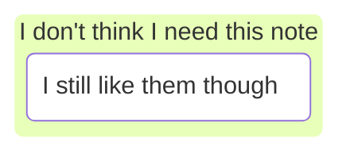
## Situation
The pdb dicegame tutorial is kinda kicking my butt. I have made it playable but the dice still won't roll and print. I need to make another call in GameRunner.run(), to have the dice roll again, then it will print that new die value.

Gemini, also caught another bug. 

runner.py:46  print("The answer is: {}".format(runner.answer()))

@property 
def answer(self)

since 'answer' is now a property (attribute) of (because of @property) runner(the instance), runner.answer does not need () to be called on because answer now acts like an integer variable. 
if runner.answer() is used, "TypeError: 'int'object is not callable because its looking for a variable, not an object.

@classmethod

normally, methods inside a class are instance methods.
They take *self* as their first argument, meaning they only u work on a specific, already-created object (like one specific game runner).

The @classmethod decorator changes the method so it belongs to the class itself, not the instance of the class.
@classmethod (run) is attached to GameRunner (the class).
run is now a method (a function that *does* something), meaning you still need parentheses.

**Normal Methods:** Python automatically hands the method the specific, living object (the instance) so it can see its own stats. we call this *self*.
**Class Methods:** Python automatically hands the method the blueprint (the Class). We call this cls.

To help with clarification:
- The class = the blueprint
- The instance = the actual house

cls() is not run in disguise, its GunRunner in disguise. 


### Virgo Meeting with Akshita and Dan

They are't talking about merge requests for the VirgoActor
VirgoActor.py:78

Camera issue: the camera can lock up if it goes too close to the focal point.
  the camera should be blocked at a certain distance from the focal point.  
  either bounce back, or stop from moving forward because the distance is too close already.

Dan suggested that I work off of Akshita's branch and this way I can start and work off her.
She can help point me in the right direction when I veer off.

I finally pulled the proper branch.
had some difficulties with cleaning up my garbage branch before I pulled Akshita's branch.
Where I initially messed up is, I 'git clean'-ed my home directory like a dummy. So most of the essential git related files were deleted. 
Luckily, git saves your state all the time so getting it back wasn't bad.
So when I cleaned the home directory, my .bashrc file was erased, and this meant my terminal did not know where I was. 
The file .bashrc is a configure file in the home directory,
It tells the terminal what alias's I like to use, what the computers name is username, etc.
To get it back, I could copied the system's skeleton template,
1. cp /etc/skel/.bashrc ~/
2. source ~/.bashrc

But, the file was totally gone, so we made a brand new one.
1. echo "export PS1="\u@\h:"w$ "' > ~/.bashrc
2. source ~/.bashrc  # to activate it

I swapped directories to the Virgo directory, and everything was pretty easy to pull from Akshita's branch.
Well first I cleaned my branch up to do the fetch.

1. I made a .gitignore file with vim
2. then added them into .gitignore via
   1. echo "deps/trickpy/_ _ pycache _ _/" >> .gitignore
   2. echo "_ _ pycache _ _/" >> .gitignore


Then to pull from Akshita's branch
1. git fetch # to pull all the status from the main branch. updating my branches info
2. git switch 32-support-rectangular-prism-prefab


### Where:

"/home/esmoss/Log/Tutorials/pdb-tutorial/pdb-tutorial/dicegame/runner.py", line 7, in __init__
    self.dice = Die.create_dice()

### File: 

/home/esmoss/Log/Tutorials/pdb-tutorial/pdb-tutorial/dicegame/runner.py

### Action: 

Need to make the run function call for the die to be rolled again.

### Error produced:

(.venv) [esmoss@fslpws0008 pdb-tutorial]$ python main.py 
Add the values of the dice
It's really that easy
What are you doing with your life.
Traceback (most recent call last):
  File "/home/esmoss/Log/Tutorials/pdb-tutorial/pdb-tutorial/main.py", line 13, in <module>
    main()
  File "/home/esmoss/Log/Tutorials/pdb-tutorial/pdb-tutorial/main.py", line 9, in main
    GameRunner.run()
  File "/home/esmoss/Log/Tutorials/pdb-tutorial/pdb-tutorial/dicegame/runner.py", line 25, in run
    runner = cls()
             ^^^^^
  File "/home/esmoss/Log/Tutorials/pdb-tutorial/pdb-tutorial/dicegame/runner.py", line 7, in __init__
    self.dice = Die.create_dice()
                ^^^^^^^^^^^^^^^
AttributeError: type object 'Die' has no attribute 'create_dice' 

### Solution: In the works
EDIT (on 07/01/2026): I abandoned this problem to work on the work items for Virgo.

### Notes on issue and solution: 
Did not solve


### Git Path
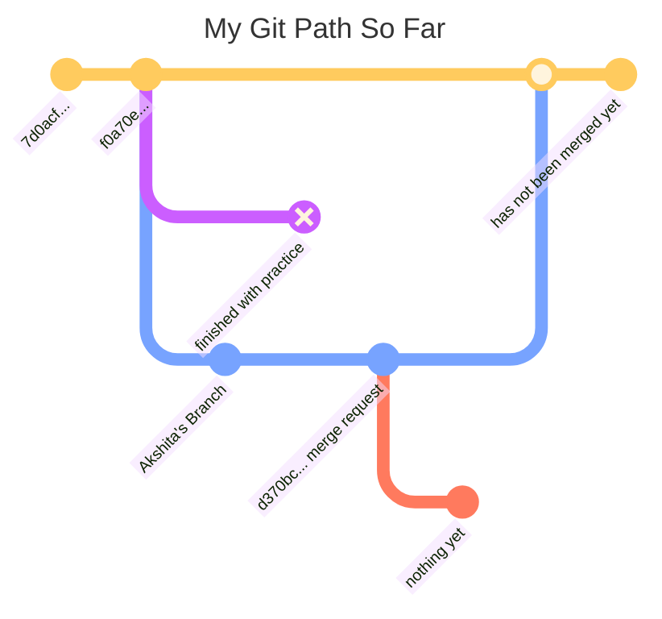

# **Week June 29 2026 - July 3 2026**
---

# Date: 06/29/26 


## Goals for the Day
Today I think I am going to start messing with the Virgo code to see what I can do. I'd like to make improvements to the cube/cylinder class/method. 

Check the work item log for some simple things to complete.

## Notes on day:

45.48 seconds with 45 degrees

Akshita pushed some commits and I *merged* with her branch to stay up to date.
I did this by **git fetch origin**, then **git merge origin/32-support-rectangular-prism**.
I had to clean up a bit so I ran **git stash** and **git clean -f**.

ok, i think i might have found where self.scene gets placed into the virgo program.
This would help pinpoint where to alter the VIRGO_PREFAB so that *scale* can be altered.

* (Pdb) where
* /home/esmoss/virgo/examples/cannon/cannon.py(239)<module>()
* ->sys.exit(CannonExample().run())
* /home/esmoss/virgo/examples/cannon/cannon.py(235)run()
* -> self.v.initialize()
* /home/esmoss/virgo/VirgoDataPlayback.py(44)initialize()
* -> super().initialize()
* /home/esmoss/virgo/Virgo.py(2113)initialize()
* ----> self.initialize_nodes()   # Load all actors from the self.scene info
* /home/esmoss/virgo/Virgo.py(2391)initialize_nodes()
* -> actors[a] = self.create_actor(actor_name=a, actor_scene_dict=self.scene['actors'][a])
* /home/esmoss/virgo/Virgo.py(2189)create_actor()
* -> actor = VirgoActor(
* /home/esmoss/virgo/VirgoActor.py(87)__init__()
* -> self._map_mesh(self.mesh)
* /home/esmoss/virgo/VirgoActor.py(368)_map_mesh()
* -> self.source.SetXLength(dims[0])
* (Pdb) 

So I found a spot where it looks like scale is being applied in the code.
> *Possible location*
> /home/esmoss/virgo/VirgoActor.py(99)__init__()
> self.axes_default_scale = 0.5 # Default scaling of axes to be applied 
> ~~*another possible location*~~
> > /home/esmoss/virgo/Virgo.py(2203)create_actor()
> -> actor.GetProperty().SetOpacity(opacity) # no, this is setting the opacity
> ~~*again*~~
> > /home/esmoss/virgo/Virgo.py(2211)create_actor() # this one creates the actor
> -> return actor
> 
 
 Virgot.py:2182
 Akshita found it for me

Need to focus on writing tests

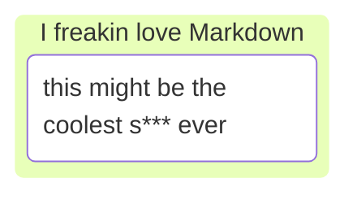
## Situation
Cleaning up a messy git repo

### Where:
~/Virgo/

### File: 
Virgo repo

### Action: 
Learn and record how to work more efficiently with git

### Error produced:
(.venv) esmoss@fslpws0008:~/virgo$ git status
On branch 32-support-rectangular-prism-prefab
Your branch is up to date with 'origin/32-support-rectangular-prism-prefab'.

Changes not staged for commit:
  (use "git add <file>..." to update what will be committed)
  (use "git restore <file>..." to discard changes in working directory)
        modified:   VirgoActor.py

no changes added to commit (use "git add" and/or "git commit -a")
(.venv) esmoss@fslpws0008:~/virgo$ 

### Solution:
| git restore . | **or** | git restore <whole damn path -> Virgo |


### Notes on issue and solution: 
I almost remembered how to do this. I just forgot about the . and putting the name of the file after restore.


---

# Date: 06/30/26 

## Goals for the Day
Create a unit test for the cylinder dimensions in Virgo

## Notes on day:
In thinlinc, I had difficulties getting back into the virtual environment.
I fixed it by going to the virgo directory and putting in this command **python3.11 -m venv .venv && source .venv/bin/activate**.
This put me back into **(.venv) esmoss@fslpws0008:~/virgo$**.


To run a unit test, you write **python -m unittest <filename>**.
The flag -m stands for "module".
When you use -m, you are telling python: "look in your library of installed modules, find the one called *unittest*, and run it as if it were a standalone script."

In an attempt to run some unit tests on the ut_VirgoActor.py I found some things out.
The self.vis calls are actually showing the dimentions of the object or mesh.

I cleaned my repo, fetched, and merged with Akshita's repo again, and it all works.
Now i am trying to understand what is going on in the tests.
Gemini says that the error  

>AssertionError: Tuples differ: (0.5, 0.5, 0.5) != (0.2, 0.5, 0.5)
>
>First differing element 0:
>0.5
>0.2

(because i intentianally broke the test to see what happens) seen means that, 'the error message isnt showing you the rule it was looking for; it is showing you the reality of what went wrong.'

the **self.assertEqual(A, B))** is saying 'I demand that the codes output be equal to what I put in here. If not, then raise an error." 
There is also a **self.assertNotEqual(A, B)** says 'If A and B are not equal great, if equal throw the error'.

Also, look into the module **unittest**.

ok. Big news. I made a commit. 
>(.venv) esmoss@fslpws0008:~/virgo$ git log
>commit c8704d339cdd6280da3ee0ea49615304489edd8f (HEAD -> 32-support-rectangular-prism-prefab)
>Author: Moss <esmoss@fslpws0008.fsl.jsc.nasa.gov>
>Date:   Tue Jun 30 11:46:15 2026 -0500
>
>    In ut_VirgoActor.py:133,134 Ethan added assert lines for scale and dimensions.

I was also assigned another task by Dan. 
**The task is to add functions enable_trails() and disable_trails() to Virgo.py**.

The toggle_trails() function works well for inverting trail status for all nodes, but there is no function to just disable or enable the trails for all nodes. In a conversation with @nelson.m.guerreiro today we learned his Ramtares extensions would benefit from these new functions.
Assigning to @ethan.s.moss as I think this is a good standalone issue for him to tackle.  To close out the issue we need

c8704d339cdd6280da3ee0ea49615304489edd8f

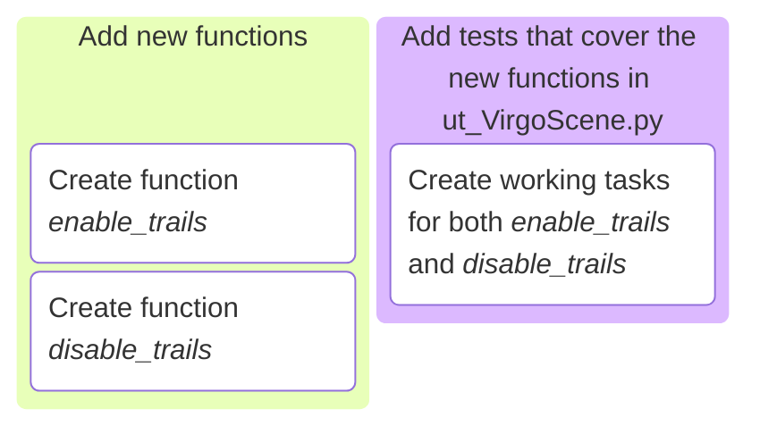
---
**under construction**
### put into the kanban above, or some other diagram
Convert to child item
     
Disable list item
Delete 

No child items are currently assigned. Use child items to break down work into smaller parts.
**under construction**

### Git Path
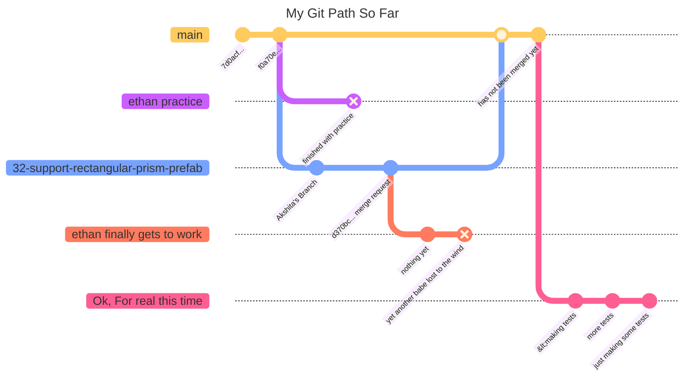

---
## Situation:
Making unit test for cylinder

### Where:
~/virgo/tests/

### File: 
ut_VirgoActor.py:129-143

### Action: 
ran test several times to ensure success.

### Error produced:
sometimes,

```
{
(.venv) esmoss@fslpws0008:~/virgo/tests$ python -m unittest ut_VirgoActor.
>VirgoActorTestCase.test_init_with_cylinder 
>Visualizing ut_VirgoActor.VirgoActorTestCase.test_init_with_cylinder. Exit window (q) to continue.
> /home/esmoss/virgo/tests/ut_VirgoActor.py(143)test_init_with_cylinder()
> -> assert_allclose(bb, [-1.0, 1.0, -2.5, 2.5, -0.998027, 0.998027])
> (Pdb) print(bb)
> (-1.0, 1.0, -2.5, 2.5, -0.9980267286300659, 0.9980267286300659)
> (Pdb) quit
> E
======================================================================
>ERROR: test_init_with_cylinder (ut_VirgoActor.VirgoActorTestCase.test_init_with_cylinder)
>Test the VIRGO_PREFAB:cylinder option with custom scaling
----------------------------------------------------------------------
>Traceback (most recent call last):
  File "/home/esmoss/virgo/tests/ut_VirgoActor.py", line 143, in test_init_with_cylinder
    assert_allclose(bb, [-1.0, 1.0, -2.5, 2.5, -0.9980267286300659, 0.9980267286300659])
    ^^^^^^^^^^^^^^^
  File "/usr/lib64/python3.11/bdb.py", line 90, in trace_dispatch
    return self.dispatch_line(frame)
           ^^^^^^^^^^^^^^^^^^^^^^^^^
  File "/usr/lib64/python3.11/bdb.py", line 115, in dispatch_line
    if self.quitting: raise BdbQuit
                      ^^^^^^^^^^^^^
bdb.BdbQuit

----------------------------------------------------------------------
>Ran 1 test in 79.934s
>
>FAILED (errors=1)
}
```

### Solution: 
Dan instructed me on how to evaluate the test as you go, and stated that throwing a wrench in the program was a good way to see how it works. 
So each iteration of changing the test to pin point a specific part of the codebase, give you more clues on what is either wrong or correct with your test. 
Being able to put *pdb.set_trace()* in the code to see what is going on under the hood, is surgical debugging. 
It is a fantastic tool.

Talking about the *pdb* tool, you can print an variables to see what their actual values are.
There was a point where we copied and pasted the "actual" array the code wanted, but it is so precise that we needed to print what bb actually was to find the entire value. 
ex.  
[4]: -0.9980267286300659 (ACTUAL), -0.998027 (DESIRED)
[5]: 0.9980267286300659 (ACTUAL), 0.998027 (DESIRED)
here (DESIRED) is basically saying, "in the test you stated that you wanted this value, but the actual is that super precise number".

I also made another one and i'll put it below for my future reference:

```
{
def test_init_with_scale_bb_cylinder(self):
  """
  Test the VIRGO_PREFAB:cylinder option with custom scaling and bounds
  """
  self.instance = VirgoActor(mesh="VIRGO_PREFAB:cylinder", dimensions=[5, 1], scale=0.5)
  #self.vis(actors=self.instance, show_origin=1, show_grid=1)

  self.instance.initialize()
  self.assertEqual(self.instance._user_scale, 0.5)
  self.assertEqual(self.instance.GetScale(), (0.5, 0.5, 0.5))
  bb = self.instance.GetBounds()
  self.vis(actors=self.instance, show_origin=1, show_grid=1)
  # Seeing if the bounds reflect the new scaling
  #import pdb; pdb.set_trace()
  # Z radius has no vertex at x=0. when x=0, z is at midpoint between vertcies. 
  #thus the z(+-) being != 0.5
  assert_allclose(bb, [-0.5, 0.5, -1.25, 1.25, -0.49901336431503296, 0.49901336431503296])
}
```

In between i was making commits the whole time. to save my progress so i dont lose anything

### Notes on issue and solution: 

## Final thoughts on day
Ensure that the Gantt Chart at the bottom of the doc is updated daily.
Needs to be finalized first though with work items and hopeful deadlines.


---

# Date: 07/01/26 

## Goals for the Day
I want to work on work item *Daniel-Jordan/virgo#39*. The project details are to 

**Add functinos enable_trails and disable_trails to Virgo.py**
* The toggle_trails function works well for inverting trail status for all nodes, but there is no function to just diable or enable the trails for all nodes. In a conversation with @nelson.m.guerreiro today, 06/30/26, we learned his Ramtares extensions would benefit from these new functions. Assigning to @ethan.s.moss as I think this is a good standalone issue for him to tackle
* To close out the issue we need
  1. add new functions
  2. add tests that conver the new functions in ut_VirgoScene.py

Been reading into this Virgo.py. 
In the [future ethan here, thats in **VirgoNode.py**] ~~class VirgoSceneNode(), on lines 721 - 738, there are some functions for the trail.~~
The trail is made available by the nodes. 
~~Line 772 is the function *create_trail(self, color=(1.0, 1.0, 1.0), thickness=2, opacity=1.0):*.~~

There is also a file named **VirgoTrail.py** with a class called *VirgoTrail*. 
probably important.

[x] Success

## Notes on day:
Ok. This is the code that I added to **Virgo.py**
```
{
def enable_trails(self):
  """Turn ON actor trails and start calculating math"""
  /# 1. Flip the master math flag (so the simulation knows to record)
  self.record_trails = True 
  /# 2. Turn on the visuals for all nodes
  for n in self.nodes:
      if not self.nodes[n].is_trail_visible():
        self.nodes[n].show_trail()
  print("Trails ENABLED")

def disable_trails(self):
  """Turn OFF actor trails and stop calculating math"""
  /# 1. Flip the master math flag (so the simulation stops recording)
  self.record_trails = False
  /# 2. Turn off the visuals for all nodes
  for n in self.nodes:
    if self.nodes[n].is_trail_visible():
      self.nodes[n].hide_trail()
  print("Trails DISABLED")
}
```
**^^^ this did not Work ^^^**


Working on the tests now.
What I came up with.

```
{
def test_enable_trails(self):
  """
  Test the Virgo.py VirgoControlCenter function enable_trails(self)
  """
  self.instance = VirgoScene(scene=self)
  self.assertTrue(self.instance.enable_trails, True)

def test_disable_trails(self):
  """
  Test the Virgo.py VirgoControlCenter function enable_trails(self)
  """
  self.instance = VirgoScene(scene=self)
  self.assertFalse(self.instance.disable_trails, False)
}
```
**^^^ This aint it either ^^^**

!!!TO RUN THE TESTS!!!
  **python -m unittest <filename>**

We'll see if it works.
well not the first try. 

```
{
======================================================================
ERROR: test_disable_trails (ut_VirgoScene.VirgoSceneInitTestCase.test_disable_trails)
Test the Virgo.py VirgoControlCenter function enable_trails(self)
----------------------------------------------------------------------
Traceback (most recent call last):
  File "/home/esmoss/virgo/tests/ut_VirgoScene.py", line 88, in test_disable_trails
    self.instance = VirgoScene(scene=self)
                    ^^^^^^^^^^^^^^^^^^^^^^
  File "/home/esmoss/virgo/Virgo.py", line 2058, in __init__
    self._verify_scene()
  File "/home/esmoss/virgo/Virgo.py", line 2183, in _verify_scene
    vdv = VirgoDictVerifier(scene_dict=self.scene, yaml_file=self.scene_yaml_path)
          ^^^^^^^^^^^^^^^^^^^^^^^^^^^^^^^^^^^^^^^^^^^^^^^^^^^^^^^^^^^^^^^^^^^^^^^^
  File "/home/esmoss/virgo/VirgoDictVerifier.py", line 642, in __init__
    self.scene_dict = scene_dict.copy()
                      ^^^^^^^^^^^^^^^
AttributeError: 'VirgoSceneInitTestCase' object has no attribute 'copy'

======================================================================
ERROR: test_enable_trails (ut_VirgoScene.VirgoSceneInitTestCase.test_enable_trails)
Test the Virgo.py VirgoControlCenter function enable_trails(self)
----------------------------------------------------------------------
Traceback (most recent call last):
  File "/home/esmoss/virgo/tests/ut_VirgoScene.py", line 81, in test_enable_trails
    self.instance = VirgoScene(scene=self)
                    ^^^^^^^^^^^^^^^^^^^^^^
  File "/home/esmoss/virgo/Virgo.py", line 2058, in __init__
    self._verify_scene()
  File "/home/esmoss/virgo/Virgo.py", line 2183, in _verify_scene
    vdv = VirgoDictVerifier(scene_dict=self.scene, yaml_file=self.scene_yaml_path)
          ^^^^^^^^^^^^^^^^^^^^^^^^^^^^^^^^^^^^^^^^^^^^^^^^^^^^^^^^^^^^^^^^^^^^^^^^
  File "/home/esmoss/virgo/VirgoDictVerifier.py", line 642, in __init__
    self.scene_dict = scene_dict.copy()
                      ^^^^^^^^^^^^^^^
AttributeError: 'VirgoSceneInitTestCase' object has no attribute 'copy'

----------------------------------------------------------------------
Ran 3 tests in 1.525s

FAILED (errors=2)
}
```

### The working functions
```
{
   ~# Enable Trails Function~
    ~@virgo_console~  
    ~def enable_trails(self):~
        ~"""Turn ON actor trails and start calculating math"""~
        ~# 1. Flip the master math flag (so the simulation knows to record)~
        ~self.record_trails = True~ 
        ~# 2. Turn on the visuals for all nodes~
        ~for n in self.nodes:~
            ~if not self.nodes[n].is_trail_visible():~
                ~self.nodes[n].show_trail()~
        ~print("Trails ENABLED")~

    ~# Disable Trails Function~
    ~@virgo_console~
    ~def disable_trails(self):~
        ~"""Turn OFF actor trails and stop calculating math"""~
        ~# 1. Flip the master math flag (so the simulation stops recording)~
        ~self.record_trails = False~
        ~# 2. Turn off the visuals for all nodes~
        ~for n in self.nodes:~
            ~if self.nodes[n].is_trail_visible():~
                ~self.nodes[n].hide_trail()~
       ~print("Trails DISABLED")~
}
```
### The working tests
```
{
 def test_enable_trails(self):
        """
        Test the Virgo.py VirgoControlCenter function enable_trails(self)
        """
        self.instance = VirgoScene(scene=self.scene, headless=True)
        self.instance.enable_trails()
        self.assertTrue(self.instance.record_trails)

    def test_disable_trails(self):
        """
        Test the Virgo.py VirgoControlCenter function enable_trails(self)
        """
        self.instance = VirgoScene(scene=self.scene, headless=True)
        self.instance.disable_trails()
        self.assertFalse(self.instance.record_trails)
}
```
## Work Item thoughts

So, there were a lot of things that were good learning events for me. 

I asked Gemini what the self, self.bla things are.
It said that a *Method* is just a function that lives inside the class (like enable_trails(self)).
It said that an *Attribute* is a variable that belongs to the object (like self.record_trails).

```
{
  class Robot:
  def __init__(self):
    # 'self.name' is an attribute of the ROBOT, not of the __init__ method.
    self.name = "R2-D2"
    self.battery_level = 100

  def say_hello(self):
    # because 'name' belongs to 'self' (the robot), this method can access it
    print(f"Beep boop! I am {self.name}.")
}
```


## Situation

### Where:

### File: 

### Action: 

### Error produced:

### Solution: 

### Notes on issue and solution: 

## Final thoughts on day

Ensure that the Gantt Chart at the bottom of the doc is updated daily.
Needs to be finalized first though with work items and hopeful deadlines.

---

# Date: 07/07/26 

## Goals for the Day


## Notes on day:
I had a day full of errors and learning.
I worked on my enable_trails() and disable_trails() functions and was able to get those tests working.
I also was able to get my tests for the CYLINDER_PREFAB to work as well. 
Dan stopped by to help me clean up my branch because I made it with both issues work in one branch.
This is not how we do this.
Each issue (work item) has its own branch. 
Once he helped me clean it up, I pushed the merges.

I can't exactly remember how we made the changes but I know that we made the new branch, copied the commits that were part of the issue for enable and disable trails. 
These were then committed and pushed.

Went back into the older branch and erased the commits that were now pushed in the new branch. 
Once that was cleaned up I made my commit. 
Akshita did make a mistake that probably cost me an hour because I thought I messed up.
She worked on an issue and committed it to my old branch. 
This made my tests not work, and nearly put me in a panic.

She corrected her mistake and everything went back to normal. 
Once all was fixed, I quickly committed my changes and pushed them to gitlab.


## Situation

### Where:

### File: 

### Action: 

### Error produced:

### Solution: 

### Notes on issue and solution: 


---

# Date: 07/xx/26 

## Goals for the Day


## Notes on day:

## Situation

### Where:

### File: 

### Action: 

### Error produced:

### Solution: 

### Notes on issue and solution: 

# **EXAMPLES**
### **KANBAN EXAMPLE**
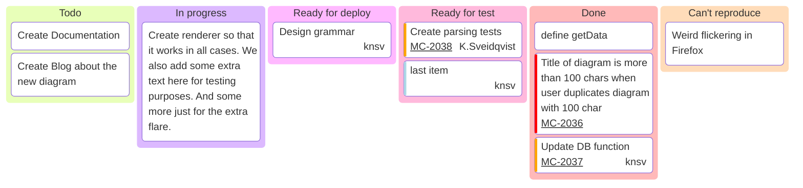

### **SANKEY EXAMPLE**
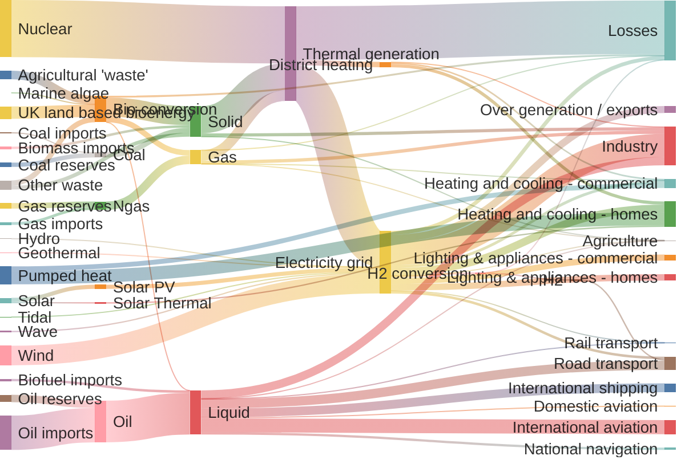
---
### **GANTT EXAMPLE**
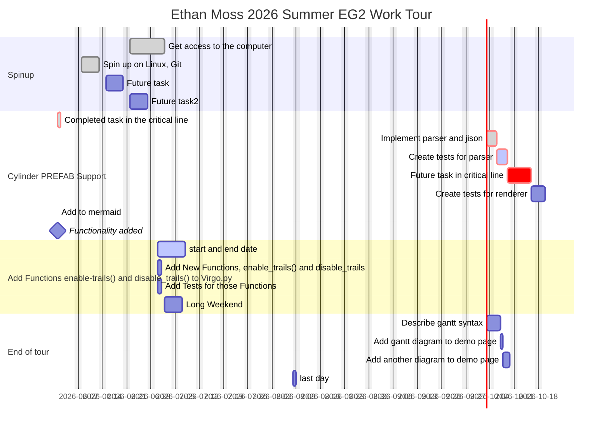


---

# Date: 07/xx/26 

## Goals for the Day


## Notes on day:

## Situation

### Where:

### File: 

### Action: 

### Error produced:

### Solution: 

### Notes on issue and solution: 


---

# Date: 07/xx/26 

## Goals for the Day


## Notes on day:

## Situation

### Where:

### File: 

### Action: 

### Error produced:

### Solution: 

### Notes on issue and solution: 


---

# Date: 07/xx/26 

## Goals for the Day


## Notes on day:

## Situation

### Where:

### File: 

### Action: 

### Error produced:

### Solution: 

### Notes on issue and solution: 


---

# Date: 07/xx/26 

## Goals for the Day


## Notes on day:

## Situation

### Where:

### File: 

### Action: 

### Error produced:

### Solution: 

### Notes on issue and solution: 


---

# Date: 07/xx/26 

## Goals for the Day


## Notes on day:

## Situation

### Where:

### File: 

### Action: 

### Error produced:

### Solution: 

### Notes on issue and solution: 


This is some code about the pdb (python debugger) and need to do a pdb tutorial
```
{
(.venv) [esmoss@fslpws0008 launch]$ ./launch.py 
Simulation complete. Output written to log_lv.csv
[koviz] Listening on 127.0.0.1:64053
[koviz] KovizThread started, is_alive=True
Loading data from /home/esmoss/virgo/examples/launch...
Done.
> /home/esmoss/virgo/Virgo.py(2386)initialize_nodes()
-> actors[a] = self.create_actor(actor_name=a, actor_scene_dict=self.scene['actors'][a])
(Pdb) list
2381 	        trails = {}
2382 	
2383 	        if 'actors' in self.scene and self.scene['actors'] != None:
2384 	          for a in self.scene['actors']:
2385 	            import pdb; pdb.set_trace()
2386 ->	            actors[a] = self.create_actor(actor_name=a, actor_scene_dict=self.scene['actors'][a])
2387 	            actors[a].initialize()
2388 	
2389 	            node, parent_name = self.create_node(actor=actors[a],
2390 	                                                 actor_scene_dict=self.scene['actors'][a],
2391 	                                                 _class=ancc)
(Pdb) s
--Call--
> /home/esmoss/virgo/Virgo.py(2157)create_actor()
-> def create_actor(self, actor_name, actor_scene_dict=None,):
(Pdb) list
2152 	        """
2153 	        from VirgoDictVerifier import VirgoDictVerifier
2154 	        vdv = VirgoDictVerifier(scene_dict=self.scene, yaml_file=self.scene_yaml_path)
2155 	        self.scene = vdv.verify()
2156 	
2157 ->	    def create_actor(self, actor_name, actor_scene_dict=None,):
2158 	        """
2159 	        Given a single scene's actors: sub-entry, return a
2160 	        VirgoActor instance built from that information
2161 	
2162 	        TODO all this checking for dict/YAML validity needs to be safer, i.e.
(Pdb) pprint(actor_name)
*** NameError: name 'pprint' is not defined
(Pdb) print(actor_name)
earth
(Pdb) print(actor_scene_dict)
{'scale': 1.0, 'opacity': 1.0, 'pos': [0.0, 0.0, 0.0], 'ypr': [0.0, 0.0, 0.0], 'color': None, 'pickable': False, 'parent': 'ecef_frame', 'backface_culling': True, 'provide_data': None, 'axes': None, 'trail': None, 'driven_by': None, 'labels': {}, 'mesh': 'VIRGO_PREFAB:wgs84-earth'}
(Pdb) 
}
```

```
Documented commands (type help <topic>):
========================================
EOF    c          d        h         list      q        rv       undisplay
a      cl         debug    help      ll        quit     s        unt      
alias  clear      disable  ignore    longlist  r        source   until    
args   commands   display  interact  n         restart  step     up       
b      condition  down     j         next      return   tbreak   w        
break  cont       enable   jump      p         retval   u        whatis   
bt     continue   exit     l         pp        run      unalias  where    

Miscellaneous help topics:
==========================
```

Virgo.py:2157
