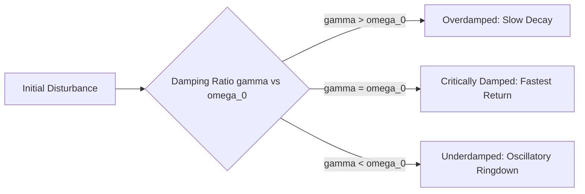

# Lecture 01: [Topic Title]

> **Quick Navigation:** [Summary](#summary--bottom-panel) • [Active Recall Cues](#recall-cues--questions--left-panel) • [Detailed Notes](#lecture-notes--right-panel) • [Action Items](#action-items--next-steps)

---

## Summary (Bottom Panel)
<!-- 
Post-Class Review: 2–3 sentences in plain language answering:
"What is the core physical/mathematical takeaway of this lecture?"
-->
- **Core Concept:** 
- **Key Result:** 
- **Big Picture Connection:** 

---

## Recall Cues & Questions (Left Panel)
<!-- 
Post-Class Review: Write active-recall prompts, test questions, or key indices that point to the notes below.
When studying, hide the "Lecture Notes" section and test yourself against these prompts.
-->

| Ref ID | Cue / Concept Question | Quick Answer / Reference |
| :--- | :--- | :--- |
| **Q1** | *e.g., What condition yields critical damping?* | $\gamma = \omega_0$ (fastest decay without oscillation) |
| **Q2** | *e.g., How do boundary conditions apply to $x(t)$?* | Apply to position $x(0)$ first, then differentiate for $\dot{x}(0)$ |
| **Q3** | *e.g., [Exam Trap] Where do sign errors commonly occur?* | Damping force opposes velocity ($-c\dot{x}$) |
| **Q4** | *[Add question here]* | *[Add answer/tag here]* |

---

## Lecture Notes (Right Panel)
<!-- 
Live Capture: Raw notes, derivations, diagrams, board sketches, professor commentary.
Use standard LaTeX ($...$ inline, $$...$$ block) for clean GitHub/VS Code math rendering.
-->

### 1. Main Governing Equations & Derivations

$$m\ddot{x} + c\dot{x} + kx = 0$$

Dividing through by $m$:

$$\ddot{x} + 2\gamma\dot{x} + \omega_0^2 x = 0$$

Where:
- $\gamma \equiv rac{c}{2m}$ (damping parameter)
- $\omega_0 \equiv \sqrt{rac{k}{m}}$ (undamped natural frequency)

---

### 2. Case Breakdown & Physical Regimes

1. **Overdamped** ($\gamma > \omega_0$):
   - Two real, distinct negative roots.
   - Non-oscillatory exponential decay.
2. **Critically Damped** ($\gamma = \omega_0$):
   - Repeated real root: $r = -\gamma$.
   - General solution: $x(t) = (C_1 + C_2 t)e^{-\gamma t}$.
   - Minimum time to return to equilibrium without overshoot.
3. **Underdamped** ($\gamma < \omega_0$):
   - Complex conjugate roots: $r = -\gamma \pm i\omega_d$, where $\omega_d = \sqrt{\omega_0^2 - \gamma^2}$.
   - Oscillatory decay within envelope $\pm A e^{-\gamma t}$.

---

### 3. Sketches & Diagrams

<!-- 
Store snips or sketches in your local assets/ directory.
Markdown relative path: 
Or write a quick Mermaid diagram directly in text:
-->

---

### 4. Instructor Commentary & Exam Warnings

>  :warning:️ **Professor Note:** 
> Always enforce boundary conditions on $x(t)$ *before* differentiating to match velocity $\dot{x}(0) = v_0$. Missing the time-derivative on product-rule terms in the critically damped solution is the #1 grading deduction.

---

## Action Items & Next Steps

- [ ] Re-derive the energy dissipation rate $\frac{dE}{dt} = -c\dot{x}^2$.
- [ ] Complete Problem Set #, Questions: 
- [ ] Cross-reference Slide # / Textbook Section: 

#### :code: shortcuts

##### Technical, Math & Lab Work
- :memo: -> (notes/summary)
- :gear: -> (configuration/settings)
- :wrench: -> (maintenance/tooling)
- :microscope: -> (lab/deep dive)
- :telescope: -> (observation/future scope)
- :test_tube: -> (experiment/test)
- :satellite: -> (telemetry/comms)
- :rocket: -> (launch/major milestone)
- :zap: -> (fast/high voltage/performance)
- :link: -> (reference/URL)

##### Warnings, Review & Callouts

- :warning: -> (caution/danger)
- :bangbang: -> (critical alert)
- :bulb: -> (key insight/idea)
- :pushpin: -> (pinned/core takeaway)
- :mag: -> (investigation/lookup)
- :white_check_mark: -> (completed/verified)
- :x: -> (failed/avoid)
- :construction: -> (work in progress)

##### Status & Prioritization

- :fire: -> (urgent/hot topic)
- :triangular_flag_on_post: -> (flag/milestone)
- :package: -> (artifact/deliverable)
- :bar_chart: -> (data/metrics)
- :lock: -> (private/restricted)
- :recycle: -> (refactor/review loop)

#### GitHub-Native Alerts
> [!NOTE]
> Highlights useful information that users should know.

> [!TIP]
> Helpful advice for doing things better or more easily.

> [!IMPORTANT]
> Key information users need to know to achieve their goal.

> [!WARNING]
> Urgent info that needs immediate user attention to avoid problems.

> [!CAUTION]
> Advises about risks or negative outcomes of certain actions.
